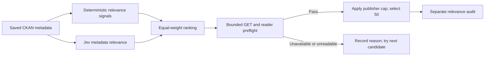
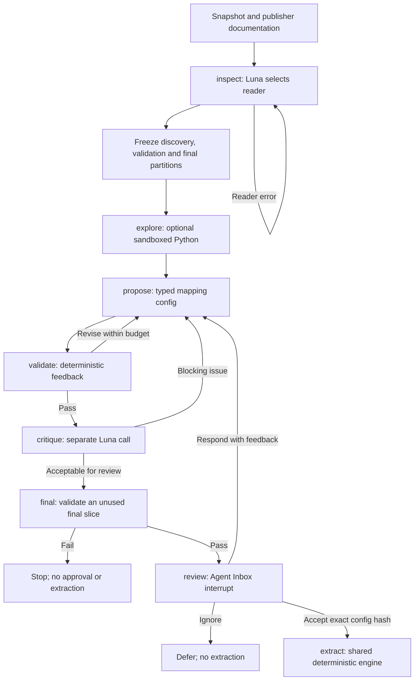
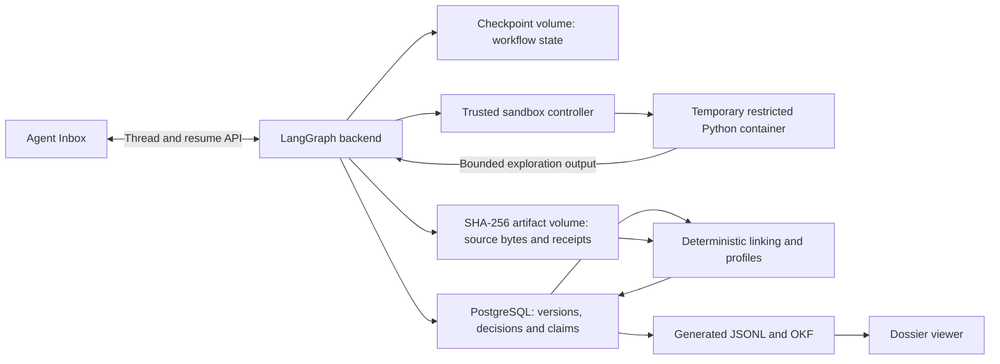

# Link Lens

A LangGraph agent investigates public business datasets and produces mapping configurations for human approval. One shared engine then extracts observations, links entities and generates profiles with provenance. The submitted run uses **Jev for triage and gpt-5.6-luna for onboarding**.

**Choose a starting point:** [How it works](#how-it-works) · [Run locally](#run-locally) · [Read the write-up](WRITEUP.md) · [Inspect saved results](outputs/README.md) · [Follow the illustrated demo](docs/DEMO.md)

## Inspect saved results without setup

No credentials, Docker or database are needed to read the submitted outputs:

- [Results and evaluation](outputs/README.md): completion status, counts, approvals and measurements.
- [OKF viewer](outputs/okf/viewer.html): open this file in a browser to explore the 52 profiles. It loads CDN libraries; use [Markdown dossiers](outputs/okf/index.md) or [screenshots](docs/DEMO.md) offline.
- [Write-up](WRITEUP.md): design decisions, evaluation, costs, source challenges and scale considerations.

The six mappings are approved. AI audits are complete; the separate human evidence checks remain pending. Saved files do **not** populate a fresh database or recreate live Inbox threads.

## How it works

[Discovery](#discovery-and-download-gate) · [Onboarding](#stateful-onboarding) · [Storage and contracts](#storage-and-runtime-contracts) · [Skip to setup](#run-locally)

### Discovery and download gate



Availability is checked before shortlisting. Semantic relevance is evaluated afterward; those labels do not feed back into the frozen ranking. Cached Jev decisions allow a download-only rerun without extra model calls. The final shortlist retains all six previously onboarded portfolio sources.

`downloadability.py` performs bounded GETs and parser preflights in rank order, with four workers and the existing eight-per-publisher cap. It retains URLs, status/error, sample hashes and reader evidence; tries up to twelve supported resources per dataset; and rejects HTML, empty files, unsupported ZIP payloads and resource-index CSVs. CSV is a 1 MiB prefix; XLSX/JSON must fit 100 MB. Public external publisher hosting is checked as well as government hosting; private destinations are blocked. HTTPS is attempted for legacy HTTP links. Failure means unavailable under this policy at this time, not permanently unavailable. The current-discovery pointer preserves the original discovery record and old evaluation IDs. Semantic evaluation remains separate from download checks.

### Stateful onboarding



The node names match [agent.py](src/link_lens/agent.py). The partition box represents work inside `inspect`; it is not a separate graph node. All automatic revision paths are bounded by model-call, mapping-version, Python, time and cost budgets. Exhaustion retains a reviewable run record without authorising extraction. Feedback-driven changes require a fresh approval and another unused final slice; final-test failure does not loop against the exposed test data.

For the eight-node transition diagram, node responsibilities, checkpointed state and tool interfaces, open [the engineering guide](docs/ENGINEERING.md), section **Part 2: LangGraph agent design**. It distinguishes structured model calls from graph-controlled execution and shows where evidence is stored.

## Run locally

### 1. Install prerequisites

Use Docker with Compose v2, `uv`, and an internet connection for dependency builds, source downloads and live inference. Commands below run from the repository root in a POSIX shell. `uv` uses Python 3.13 from `.python-version` and creates `.venv`.

```sh
uv sync --frozen
# Create the configuration without overwriting an existing .env:
if [ ! -f .env ]; then cp .env.example .env; fi
```

A first Docker build may exceed ten minutes; subsequent starts reuse images. The supplied setup uses local ports 3000, 2024, 5439 and 8091.

### 2. Fill in `.env`

Edit the copied [.env.example](.env.example) values in **`.env`**, which is ignored by Git.

| Variable | Needed for | What to supply |
|---|---|---|
| `OPENROUTER_API_KEY` | Part 1 live Jev triage | Your OpenRouter API key with access to `typesafe/jev-1.13` |
| `OPENAI_API_BASE` | Part 2 live onboarding | Your Azure/OpenAI-compatible v1 endpoint, e.g. `https://YOUR-RESOURCE.openai.azure.com/openai/v1/` |
| `OPENAI_API_KEY` | Part 2 live onboarding | The key for that endpoint |
| `LINK_LENS_MODEL` | Part 2 live onboarding | Model/deployment name accepted by your endpoint; defaults to `gpt-5.6-luna` |
| `LANGCHAIN_API_KEY` | Optional LangSmith traces | Your LangSmith key; set `LANGCHAIN_TRACING_V2=true` to enable tracing |
| `LANGCHAIN_ENDPOINT`, `LANGCHAIN_PROJECT` | Optional LangSmith traces | Your workspace endpoint and desired project name |

The code reads the exact `OPENAI_API_BASE` and `OPENAI_API_KEY` names above. A model name in the example does not provision a deployment or grant access: configure an available compatible deployment and confirm structured tool calling with the smoke test below. Use the documented model for a comparable rerun.

Local database, sandbox and API URLs are already set in the example. Docker Compose overrides their hostnames inside containers. No API key is needed for CKAN catalogue access or the local Agent Inbox connection. Keep provider keys in `.env`, not in browser settings. If you change `.env` after starting services, recreate the backend with `docker compose up -d --force-recreate backend`.

### 3. Build and start services

```sh
# Build the fixed image used for temporary Python executions:
docker compose --profile build-sandbox build sandbox-image
# Start PostgreSQL, backend, Agent Inbox and sandbox controller:
docker compose up -d --build
docker compose ps
curl --fail http://localhost:2024/api/health
uv run link-lens --help
```

The backend applies Alembic migrations at startup. All published ports bind to loopback; this is a local development setup.

| Service | Local address / purpose |
|---|---|
| Agent Inbox | [http://localhost:3000](http://localhost:3000) |
| LangGraph backend and application API | [http://localhost:2024](http://localhost:2024) |
| PostgreSQL | `localhost:5439`; host CLI defaults are in `.env.example` |
| Sandbox controller | `localhost:8091`; called by the workflow |

Open Agent Inbox and add a connection:

| Setting | Value |
|---|---|
| Graph ID | `onboard` |
| Deployment URL | `http://localhost:2024` |
| Name | `Link Lens` (or your choice) |
| API key | Leave blank for this local deployment |

An empty inbox on a fresh installation is expected. Run onboarding to create a review.

## Run the six-source pipeline

These steps download public data and make **paid model calls**. The saved submission outputs stay in `outputs/`; export your rerun to `outputs/local-run/` for comparison.

### 1. Discover and start onboarding

```sh
uv run link-lens smoke-model     # one metered structured-output call
uv run link-lens discover        # catalogue + Jev ranking + download checks
uv run link-lens portfolio       # register six sources from the new shortlist
uv run link-lens runs            # list the source run IDs
uv run link-lens onboard RUN_ID  # replace RUN_ID; repeat for each of the six
uv run link-lens runs --run-id RUN_ID
```

`onboard` runs asynchronously and pauses for review. The source portfolio must be present in the generated shortlist; public catalogue changes may require a documented substitution. Existing runs in the same experiment are reused by `portfolio`; for an independent run, set a new `LINK_LENS_EXPERIMENT_ID` in `.env` and recreate the backend **before** discovery and registration.

### 2. Review each mapping

In Inbox, inspect source semantics, field evidence, validation, before/after samples and unmapped fields. **Accept** approves the exact stored config and allows extraction; **Respond** requests a revision; **Ignore** defers the source. Use Accept rather than treating “Mark as Resolved” as application approval.

CLI alternatives:

```sh
uv run link-lens review RUN_ID accept
# Alternatively, request a revision instead of accepting:
uv run link-lens review RUN_ID respond --feedback "Explain the evidence for this field's subject role."
```

Wait for all six selected runs to report `completed`. For UI examples and review behaviour, use [the demo guide](docs/DEMO.md). For budget failures or stopped attempts, use [engineering guide](docs/ENGINEERING.md), section **Operations and recovery**.

### 3. Assemble and export

Replace `RUN_1` through `RUN_6` with your completed run IDs. Replace `BATCH_ID` with the ID returned by `assemble`.

```sh
uv run link-lens assemble RUN_1 RUN_2 RUN_3 RUN_4 RUN_5 RUN_6 --cohort-pool-size 25000
uv run link-lens export --batch-id BATCH_ID --output outputs/local-run
uv run link-lens usage
```

Open `outputs/local-run/okf/viewer.html`. The export also contains JSONL observations, links, unlinked records and profiles. Assembly requires at least 50 cross-source entities in the sampled pools and reports a failure if overlap is insufficient; it does not invent matches to meet the count. [Write-up](WRITEUP.md), section **Identity, conflicts and provenance**.

### 4. Create evaluation worksheets

```sh
uv run link-lens worksheet triage --output outputs/local-run/triage-review.json
uv run link-lens worksheet links --batch-id BATCH_ID --output outputs/local-run/link-review.json
```

Open the matching `.html` files, inspect the evidence, and save completed responses. Import the **completed downloaded JSON**, not the blank worksheet:

```sh
uv run link-lens import-labels PATH_TO_COMPLETED_TRIAGE_JSON
uv run link-lens import-labels PATH_TO_COMPLETED_LINKS_JSON
```

Human labels and AI audit labels are stored separately. [Results guide](outputs/README.md), section **9. Complete the human evaluation**.

## Other run paths

Open the linked file, then use the named section. These direct file links also work in editors that do not support jumping to a heading in another Markdown file.

| Task | Open this guide | Section and prerequisites |
|---|---|---|
| Present saved results with screenshots | [Demo guide](docs/DEMO.md) | Start at the top; no model credentials needed. |
| Onboard a seventh source and check its contribution | [Demo guide](docs/DEMO.md) | **Live seventh-source demo** — requires the six-source database evidence and live model credentials. |
| Recheck downloads using saved Jev decisions | [Part 1 report](outputs/part1-downloadable/REPORT.md) | **Repeat the Part 1 operation** — requires the saved discovery record in the database. |
| Export or restore a database archive | [Demo guide](docs/DEMO.md) | **Optional: restore a frozen demo** — restoration requires an existing local ZIP and a separate empty database. ZIPs are not included in Git. |

The demo guide covers presentation and optional workflows; the setup and six-source pipeline commands remain above.

## Storage and runtime contracts

### Evidence and presentation



The sandbox receives supplied discovery samples and documentation, not access to these stores. PostgreSQL is authoritative for structured results; the artifact volume is authoritative for referenced bytes. OKF is a generated presentation. LangSmith supplies execution traces; local usage receipts retain the measurement evidence.

### Three stores

- LangGraph development checkpointer: `run_id`, `route`, `feedback`, execution position and pending interrupt; Compose volume `checkpoints`.
- PostgreSQL: independently versioned application evidence, mappings, decisions and results. Alembic manages tables. JSON payloads preserve detailed evidence; owner and kind indexes support the small demonstration workload.
- SHA-256 artifact volume: immutable bytes, referenced by registered IDs. Exports are replaceable presentations, not the authoritative store.

A snapshot identifies its exact downloaded bytes, resource ID, licence and retrieval metadata. A source record locator is the snapshot hash, sheet or JSON array path, and logical row index. A CSV locator counts CSV records, not physical newline characters inside quoted text. A mapping hash covers its entire typed configuration. An observation includes its config/engine version, raw value, locator and required ontology envelope.

### Review contract

The stock Inbox receives a list with one `HumanInterrupt`. `allow_edit` is false. Accept uses the immutable config at the paused node; CLI Accept may additionally supply its hash. Respond is model feedback, never a hand-edited config. Ignore creates a durable deferred decision. Decisions include configured reviewer identity, timestamp and hash. This local identity is not multi-user authentication.

Human feedback that changes a mapping consumes the same bounded version budget and invalidates any previous approval. Another unused slice from the final partition is required. A final-test failure stops the run. Automatic mapping revision has no access to final-test diagnostics.

### Sandbox isolation

Execution containers have no network, repository, credentials or Docker socket. Input is discovery JSON and documentation only. Python may inspect these supplied data and print results. It cannot install dependencies or configure container privileges. The controller runs fixed images with non-root UID, read-only root, bounded tmpfs, memory/CPU/PID/output limits and timeout cleanup. The controller itself is trusted and Docker-privileged; this is not a hostile multi-tenant service.

### Interfaces

`langgraph.json` exposes graph ID `onboard` and the standard thread/run/resume API. Application routes: `POST /api/sources`, `GET /api/runs`, `GET /api/runs/{id}`, `GET /api/profiles?batch_id=…`, `POST /api/evaluations`, `GET /api/artifacts/{registered_sha256}`. See `uv run link-lens --help` for reproducible commands. There is no arbitrary path serving endpoint.

### Experiment and model boundaries

`jev-luna-v1` is the final submission configuration. Jev calls OpenRouter's `/api/alpha/decisions` through a LangChain RunnableLambda. Only supported-format catalogue candidates receive calls; state includes bounded metadata, never audit labels or held-out source records. The equal-weight blend is a declared ranking policy, not a calibrated probability. A separate deterministic GET/reader gate verifies bounded downloadability before selection. Jev responses, request hashes, timing, usage and cost are saved; a matching successful request within an experiment is reused on discovery retry.

Part 2 pins `gpt-5.6-luna` on each new run. Fresh configs require fresh Inbox approval. Existing Terra evidence is preserved in `experiments/terra-baseline/`, with checksummed comparison artifacts; optional database archives are retained locally. Scoped reports do not sum old and new costs. The comparison records catalogue and snapshot differences and avoids claiming a controlled model-only benchmark.

## Troubleshooting and shutdown

| Symptom | Check |
|---|---|
| Backend not ready | Run `docker compose logs --tail=100 backend postgres`; check migrations and port conflicts. |
| Model call returns 401/403 or model-not-found | Check the endpoint, matching key and model/deployment name in `.env`; recreate the backend after changes. |
| Sandbox image not found | Run the separate `build-sandbox` build command above. |
| Jev discovery fails | Check the OpenRouter key and provider access; successful metadata decisions are cached for retry. |
| “Requires Action” returns after Respond | This is a new mapping review, not acceptance; inspect and Accept the revised config when appropriate. |
| Viewer is empty or cannot load libraries | Check CDN/network access; use the Markdown dossiers or screenshots. |

```sh
docker compose stop             # preserves database and checkpoint volumes
# Later:
docker compose up -d
```

`docker compose down -v` removes persistent service volumes. Source bytes live separately in `artifacts/`; database records reference their hashes. Preserve both when retaining evidence. Do not share logs containing credentials.

## Verification

```sh
uv run pytest -q                 # deterministic; no model credentials required
uv run ruff check src/link_lens tests --exclude _vendor --select F
# Requires Docker, the built sandbox image and running sandbox controller:
RUN_DOCKER_TESTS=1 uv run pytest tests/test_sandbox_integration.py -q
```

The recorded suite result is **48 passed, four integration tests skipped**; earlier Docker checks are documented in [engineering guide](docs/ENGINEERING.md), section **Verification evidence**. A live smoke test is separate and metered.

## Documentation and code

| Read | Purpose |
|---|---|
| [WRITEUP.md](WRITEUP.md) | Self-contained explanation of decisions, results, costs and future work |
| [outputs/README.md](outputs/README.md) | Detailed output inventory, approvals and evaluation status |
| [docs/DEMO.md](docs/DEMO.md) | Screenshots and demonstration steps, including the seventh source |
| [Workflow and architecture](#how-it-works) | Discovery, agent loop, storage and runtime contracts in this README |
| [docs/ENGINEERING.md](docs/ENGINEERING.md) | Implementation evidence, verification and recovery |
| [outputs/COMPARISON.md](outputs/COMPARISON.md) | Preserved baseline versus the final approach |
| [docs/THIRD_PARTY.md](docs/THIRD_PARTY.md) | Component and data attribution |

Implementation is in `src/link_lens/`: `agent.py` orchestrates onboarding; `ingestion.py`, `triage.py` and `downloadability.py` handle discovery/acquisition; `contracts.py`, `readers.py` and `extraction.py` implement shared mapping execution; `resolution.py` and `profiles.py` build entities; `store.py`, `evaluation.py` and `exports.py` retain and present evidence. Service definitions are in `compose.yaml` and `deploy/`; database migrations are in `migrations/`.
