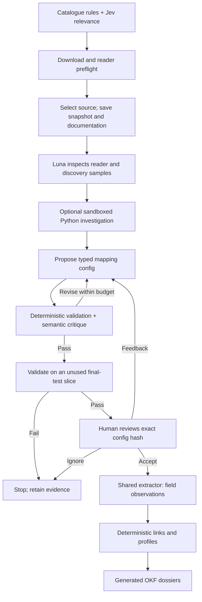

# Link Lens — source onboarding and business profiles

Link Lens makes adding a public business dataset a **mapping review**: a runtime agent investigates the source, proposes a configuration, tests and revises it, then asks a person to approve. One shared engine executes the approved configs and builds business profiles with traceable evidence.

The implementation uses **Jev for catalogue triage, gpt-5.6-luna for onboarding, and deterministic code for extraction, linking and profile assembly**. All six final mappings are approved. The pipeline and saved artifacts are complete; evaluation is partially complete, with full AI audits and human hand-checks still pending.

## Results at a glance

| Assignment part | Delivered | Evidence |
|---|---|---|
| 1. Discovery and triage | **945 catalogue records → 50 ranked, download-verified datasets** | [Shortlist](outputs/shortlist.jsonl), [download checks](outputs/part1-downloadable/REPORT.md) |
| 2. Schema inference | **6 agent-generated, approved configs; one extractor; 20,838 field observations** from 1,000 selected rows per source | [Configs](outputs/mappings/), [approval packets](outputs/README.md#8-mapping-approvals) |
| 3. Entity identification | **52 proposed links and 5,543 unlinked records**, with evidence and reasons | [Links](outputs/links.jsonl), [unlinked queue](outputs/unlinked.jsonl) |
| 4. Profiles | **52 profiles** with per-field confidence, provenance, alternatives and source-removal analysis | [Profiles](outputs/profiles.jsonl), [OKF viewer](outputs/okf/viewer.html) |
| Evaluation | AI reviewed **all 50 datasets and all 52 links**; human worksheets are ready | [Results and evaluation](outputs/README.md#3-evaluation-progress-and-results) |

An observation is one field claim, not one company. The 52 profiles come from an explicitly selected overlap cohort, not a representative sample of Australian businesses.

## How the agent works

**Discovery separates relevance from availability.** Jev scores bounded catalogue metadata; its score is blended equally with deterministic business/identifier signals. A GET and reader preflight checks candidates before selecting 50, with a cap of eight per publisher. This replaced 15 entries from the initial Jev shortlist using the same saved catalogue and scores, with no extra model calls. Readable data can still be irrelevant or semantically ambiguous; the later audit does not feed labels back into the ranking.

**Onboarding carries state between explicit LangGraph nodes.** Luna chooses reader settings, uses inspection tools, proposes a typed mapping, receives validation diagnostics and a separate semantic critique, and revises. The config records reader settings, row grain, subject role, transformations, confidence, evidence and unmapped fields. CSV/TSV, XLSX and JSON use the same engine; generated Python is exploration only, never the saved extractor.

**Validation limits feedback leakage.** After reader selection, deterministic partitions separate discovery, validation and final-test records. The model and sandbox receive discovery data; validation supplies bounded feedback. A frozen proposal must pass an unused final slice before review. Final-test failure stops the run instead of teaching the agent to fit that test. Feedback-driven config changes need another final slice and a new approval.

**Human review is a meaningful boundary.** Agent Inbox shows the licence, snapshot/config hash, reader, mappings, evidence, before/after records, validation and uncertainties. Accept approves that exact stored config; Respond requests revision; Ignore prevents extraction. Direct mapping edits are disabled. Approval of source semantics is separate from checking individual identity links.

Current defaults allow at most **3 mapping versions, 20 model calls and 8 Python executions** per attempt, with **300,000 input tokens and 60,000 output tokens**, plus time and cost bounds. The preserved submission runs used the earlier limits of 12 model calls, 100,000 input tokens and 24,000 output tokens. Failed attempts and explicit recovery runs retain their evidence and costs. LangGraph checkpoints preserve workflow state; PostgreSQL separately stores config versions and decisions. Idempotent approval/extraction prevents duplicate results on resume. [Architecture and boundaries](README.md), [recovery evidence](docs/ENGINEERING.md).

For implementation detail behind the workflow above, see [the engineering guide](docs/ENGINEERING.md), section **Part 2: LangGraph agent design**: node/edge diagrams, state ownership and the typed model/tool interfaces.

## Six datasets, one engine

The six sources span four publishers and remain in the final generated shortlist. Their differences exercise parsing and semantic decisions—not separate source-specific parsers.

| Source | Main challenge | Current profiles receiving evidence |
|---|---|---:|
| ASIC Companies | Tab-delimited “CSV”; historical/current names; leading-zero ACNs | 52 |
| ASIC Business Names | Trading name versus holder identity | 0 |
| ASIC AFS Licensees | Mixed ABN/ACN semantics and licence-specific status | 0 |
| ACNC Charities | Organisations need not be companies; charity-specific registration | 17 |
| ATO Tax Transparency | Multi-sheet Excel with an introductory sheet; numeric ABNs and reporting scope | 35 |
| Employment Provider Locations | Repeated service sites, older records and limited identifiers | 0 |

All six produce observations. Zero profile contribution means their claims remain outside this linked cohort. Counts overlap and must not be summed as unique businesses.

**The hardest semantic case was AFS.** An overly conservative critique led Luna to leave the documented mixed ABN/ACN column unmapped, reducing its contribution from 18 baseline profiles to zero. The shared engine already supports length/checksum classification; the next improvement is better evidence-grounded critique and a focused regression case. Human approval did not remove this weakness. The approved config remains intact rather than being manually patched after evaluation.

A new format or repeated, well-defined transformation could justify extending the shared engine with a typed operation and tests. A one-off parser that bypasses mapping inference would undermine reuse. The earlier Terra Credit Licensees run demonstrated another source reaching review after a shared reader repair. The prepared Luna seventh-source demo uses **ACNC 2024 AIS**, with three preflight overlaps; its live mapping and profile contribution have not yet been demonstrated. [Demo and exact commands](docs/DEMO.md#live-seventh-source-demo).

## Identity, conflicts and provenance

The entity model combines **stable internal entity IDs, explicit identifier assertions and versioned membership/link decisions**. Source records remain intact, so a later decision can split or reassign membership without losing original evidence.

Links require matching validated ABNs or ACNs and compatible subject roles. No ACN is derived from an ABN suffix. Conflicting identifiers, uncertain group/holder ownership and name-only evidence abstain. Parent/subsidiary and reporting-group relationships are not collapsed into identity; repeated trading names or service rows are handled according to declared grain.

Profile selection uses field-specific source authority followed by relevant timestamps. Alternatives and selection reasons remain visible; equally supported conflicts stay unresolved. Address bundles stay together from one source row. Source reliability, mapping confidence and link rule scores remain separate and uncalibrated. Publication timestamps are explicitly labelled as proxies; claims without defensible timestamps are quarantined.

| Removed source | Profiles with changed values | Profiles losing cross-source identity support |
|---|---:|---:|
| Companies | 52 | 52 |
| ACNC | 17 | 17 |
| ATO | 0 | 35 |
| Each of the other three | 0 | 0 |

ATO shows why provenance matters even when values do not change: removing it removes corroboration for 35 entities. Value comparisons keep original memberships fixed; linking support is separately re-resolved. [Removal results](outputs/source-removal.json).

PostgreSQL is authoritative for structured results; content-addressed files retain raw evidence. **OKF is a deterministic presentation export**, with 539 documents, 962 citation edges and no broken internal links. Its graph shows document relationships, not additional company-identity links. Neo4j is a future option if multi-hop relationship queries justify it; entity volume alone does not.

## Evaluation and measured cost

| Evaluation | AI evidence result | Human check |
|---|---|---|
| All 50 ranked datasets | **47 supported, 1 unsupported, 2 unresolved** | Random 20-item worksheet; human review pending |
| All 52 proposed links | **52 supported** at the 0.99 rule-score threshold | Random 50-item worksheet; human review pending |

The unsupported dataset contains asbestos asset records. Both unresolved datasets expose appliance brands without establishing legal ownership; downloads succeeded. The AI negative fraction is **1/48 = 2.08% among resolved dataset judgments**, with two unresolved. This is not a human false-positive estimate.

All current links share explicit valid ABNs and compatible names/roles in inspected records: 35 Companies–ATO and 17 Companies–ACNC. The pipeline chose an overlap cohort from pools of up to 25,000 rows per source, then filled each source's 1,000-row selection deterministically. **52/52 supported does not establish population precision or recall.** AI audits share source evidence with the pipeline; human precision remains unmeasured. [Individual judgments](outputs/ai-audit/LINKS_REPORT.md).

| API measurement | Recorded result |
|---|---:|
| Calls, including retained failures/retries | 292: 213 Jev + 79 Luna |
| Measured input / output tokens | 836,479 / 82,696 |
| Jev triage estimate | $0.007996044 |
| Luna onboarding plus connectivity estimate | $0.25316430 |
| **Priced subtotal** | **$0.261160344 (~$0.26), across 275/292 calls** |
| Calls with unavailable usage | 17; full total unknown |
| Per-record LLM calls for extraction/linking/profiles | **0 calls / $0** |

For one concrete source, the final approved **ATO run** recorded **9 graph steps, 2 model calls, 1 Python execution, 12,215 input and 1,475 output tokens**, and an estimated **$0.00481080**. Active node time was **16.52 seconds**, excluding human wait and queue time. This successful replacement run excludes its predecessor; the overall ledger includes both.

Costs use saved published rates, with OpenAI prices as the agreed Azure approximation and cache categories distinguished. The priced subtotal is below $10; missing usage prevents a complete spend claim. Infrastructure and assistant development/audit usage are outside the application ledger. [Rates, per-call receipts and scope](outputs/COSTS.md).

The preserved Terra baseline cost **$2.0150253 for 50/52 calls** and produced 50 profiles. The current approach has a lower recorded subtotal, but different retries, prompts and cohorts prevent an exact savings or model-quality claim. All six snapshot byte hashes match; catalogue membership differs slightly. [Three-stage comparison](outputs/COMPARISON.md).

## Scale, model upgrades and the next three weeks

| Question | Proposed approach |
|---|---|
| What breaks first between 6 and 500 sources? | Review throughput and acquisition/schema drift, followed by in-memory processing and individual database writes. Add scheduled acquisition, schema fingerprints, worker leases, bulk writes and incremental recomputation. |
| A better matching model arrives—what happens to old links? | Keep old decisions versioned. Record source/config/model/prompt and linking-policy versions, identifiers, evidence and thresholds before rollout. Evaluate the new policy on reviewed labels, run it in shadow mode, inspect changed memberships, then promote a versioned batch and recompute affected profiles. Preserve rollback; do not silently overwrite millions of links. |
| What would three weeks buy first? | Week 1: evidence-reviewed labels and AFS semantic regression cases. Week 2: acquisition reliability, drift detection and review prioritisation. Week 3: batched/incremental processing and model-upgrade replay with changed-link reports. |

The current resolver is deterministic; a future learned matcher would first propose candidates for evaluated review. The upgrade rollout above is future work, not a demonstrated production migration.

## Running and inspecting the submission

**48 deterministic tests passed; four service-dependent integration tests were skipped in that run.** Earlier Docker checks covered restricted execution, timeout cleanup and resource limits. The sandbox runs non-root without network, credentials, repository or Docker socket; only its trusted controller accesses Docker. This is local-development isolation, not production multi-tenant security.

The reusable Docker/Inbox/PostgreSQL/OKF platform exceeds the minimum assignment scope. Complete active development time was not recorded from the start, so no six-hour completion claim is made.

- **Run it:** [README](README.md), with startup commands and required services. A first Docker build may exceed ten minutes.
- **See the behaviour:** [illustrated demo](docs/DEMO.md), including screenshots and seventh-source commands.
- **Inspect the deliverables:** [results, approvals and evaluation](outputs/README.md).
- **Assess implementation and failures:** [architecture](README.md) and [engineering/verification](docs/ENGINEERING.md).

Saved JSONL and Markdown need no model credentials. The OKF viewer uses CDN libraries; screenshots provide a static alternative. Database ZIPs are optional local artifacts and are not included in Git.
