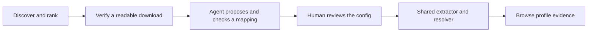
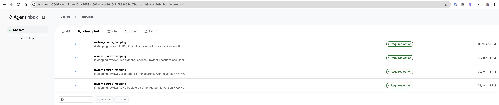
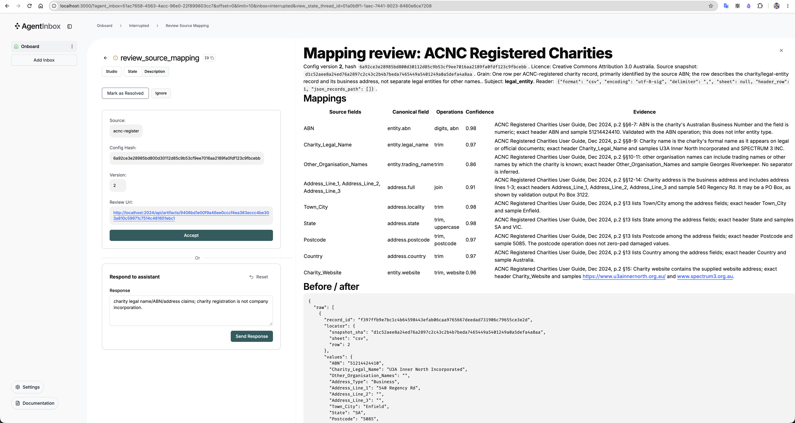
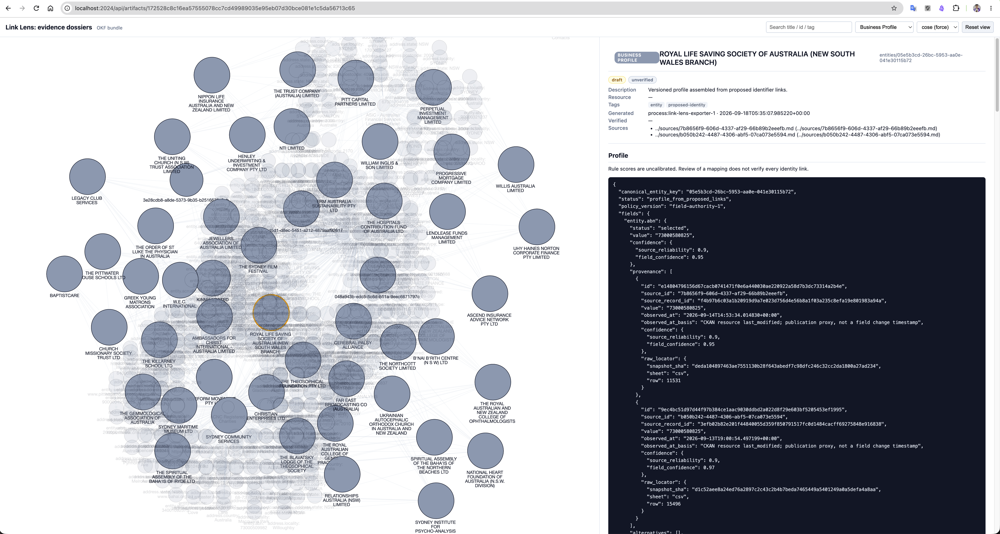
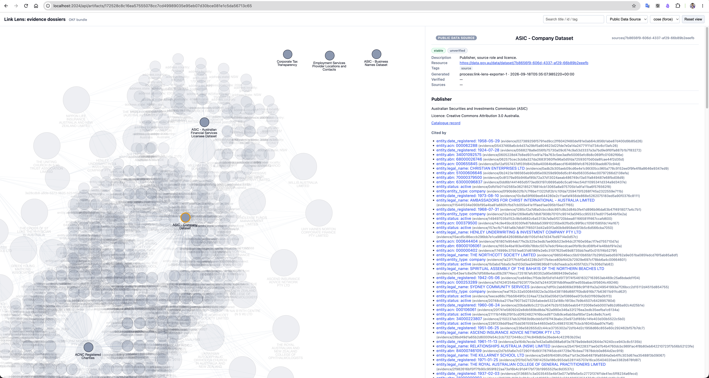
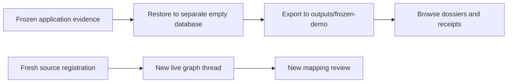

# Demo guide — from mapping review to business evidence

Use this guide for a short screen-sharing presentation. Start with saved results; use live onboarding when you want to demonstrate a new mapping. [Current results](../outputs/README.md) and [comparison](../outputs/COMPARISON.md) supply the measured numbers.

**Screenshot context:** the supplied images capture earlier stages. The Inbox images show pending reviews and an earlier ACNC v2 proposal; all six final Luna mappings are now approved. The OKF images show the Terra export generated on 18 September, so their companies and source connections can differ from the current 52-profile export. They illustrate how to read the interface, not current completion status. Click any image to inspect it at full resolution.

[Saved-results tour](#1-explain-the-result--about-one-minute) · [Live seventh-source commands](#live-seventh-source-demo) · [Optional archive restore](#optional-restore-a-frozen-demo)

## 1. Explain the result — about one minute

Open [the overview](../outputs/README.md). Say:

> “The system turns a new dataset into a mapping that a person reviews. Jev helps rank datasets; code checks that they download. Luna investigates a source and revises a declarative mapping. Once approved, one shared engine extracts observations, proposes identity links and builds profiles with evidence.”



Point out the current **50 download-verified datasets, six approved configs and 52 profiles**. Keep the distinctions visible: AI audits cover all 50 datasets and all 52 links; the separate human evaluation is pending. Cost is a **$0.261160344 priced subtotal**, with usage unavailable for 17 calls.

## 2. Show the review queue — about one minute

Open [Agent Inbox](http://localhost:3000) after following [local startup](../README.md#run-locally). Use **All** to find completed reviews; **Interrupted** lists sources waiting for a decision. An empty Interrupted tab is expected when no new mapping needs review.



*Earlier queue state. Each entry represents a mapping review, not an approval request for every tool call.*

Say: “The graph keeps its state while waiting. A completed review is tied to a specific config hash, and the application stores the decision.”

## 3. Explain one mapping — about two minutes

Open a review's description. Point to the **source licence, config hash, row grain, subject role and reader settings**, then one mapping row and its evidence. Scroll to the before/after sample, validation results and unmapped fields. Current saved packets are linked from [the review summary](../outputs/README.md#8-mapping-approvals).



*Earlier ACNC v2 proposal. The screenshot's version/hash and drafted response belong to that earlier review, not the final approved ACNC v1 run.*

| Control | Meaning | What to explain |
|---|---|---|
| Accept | Approves the exact stored config | Enables extraction after validation; it does not certify every future link. |
| Respond | Sends feedback to the agent | Produces another proposal/review when budget allows. “Requires Action” can correctly return. |
| Ignore | Defers the source | Extraction stays blocked. |

Use **Accept** for approval, rather than assuming the UI's “Mark as Resolved” action records application approval. If a review is already completed, explain the saved decision instead of sending another response just for the demo.

## 4. Follow a profile back to evidence — about two minutes

Open [the current OKF viewer](../outputs/okf/viewer.html), select **Business Profile**, and search for an entity present in that export. Select a field and point to its value, separate source/field confidence, provenance, alternatives and raw locator.



*Historical Terra profile view. Use the current export for today's results; the layout and evidence-reading process are the same.*

Say: “This profile is generated from stored claims. Each selected value retains the source record that supplied it. Confidence values are rule scores, and equally supported conflicts can remain unresolved.”

Change the filter to **Public Data Source** and select ASIC Companies. Show its publisher, licence and citations.



*Historical Terra source view. Its AFS connections differ from the final Luna cohort. In the current batch, Companies, ACNC and ATO supply linked-profile evidence.*

The graph visualises document citations. A visible graph edge is not automatically a company-identity link. A source with no citations was still processed; its observations may remain outside these linked profiles. [Contribution and source-removal tables](../outputs/README.md#2-what-was-processed-and-which-sources-contributed).

## 5. Finish with one evaluation and one next improvement

Open the [all-50 dataset audit](../outputs/ai-audit/full-shortlist-report.html) or [all-link evidence audit](../outputs/ai-audit/links-report.html). Show an individual reason, not just a percentage.

Explain that **50 readable downloads** and **47 supported relevance judgments** measure different things. The two unresolved appliance datasets have accessible files but ambiguous brand ownership. For a mapping improvement, use the AFS mixed-identifier example in [the comparison](../outputs/COMPARISON.md).

## Optional live seventh-source demo

Follow [the live seventh-source section](#live-seventh-source-demo) for the exact ACNC 2024 AIS commands. It has three preflight overlaps with existing profiles; a new generated mapping still needs validation and approval before contribution can be measured. This is a prepared candidate, not a promised successful run.

For a presentation without model calls, use the existing Markdown/JSON and viewer. The viewer loads CDN libraries; keep these screenshots available if that fails. For restoring a database, follow [the frozen-demo guide](DEMO.md#optional-restore-a-frozen-demo); restore into a separate empty database and export to a separate folder because the archive predates the latest Part 1 revision.

## Live seventh-source demo

**Current Jev + Luna cohort:** Commands below use the completed 52-profile batch and its six approved runs. The 2024 AIS source is reserved for a future live demonstration; it has not been onboarded with Luna.

**Use this guide for the next live onboarding demo.** ASIC Credit Licensees was already onboarded, approved and extracted, but never included in the six-source profile batch. Its original evidence remains available. The new candidate below has been investigated for overlap only: **no mapping was written, no model onboarding was run, and no approval was fabricated**.

For the screen-sharing sequence and examples of what the reviewer sees, use [the illustrated demo](DEMO.md).

### Why this dataset

Choose **[ACNC 2024 Annual Information Statement (AIS) Data](https://data.gov.au/data/dataset/276ec1bc-4971-461c-88bc-be9f3c99a0f8)**, slug `acnc-2024-annual-information-statement-ais-data`. It was in the original Terra shortlist; the new Jev shortlist selects other ACNC years under the publisher cap. The seventh-source demonstration deliberately accepts an additional discovered dataset outside the six-source portfolio. Explicitly select its main AIS CSV, resource `710630ea-1202-4bbb-95f7-3973a972ddf8`; do not accidentally choose the separate programs file.

The current-cohort recheck found **3 exact ABN overlaps with the 52 profiles**, using the saved 8 MB prefix (12,025 complete rows), without another download. [Saved IDs, source artifact, locators and publisher documentation](../outputs/seventh-source-preflight.json).

| Existing profile | ABN | CSV logical row |
|---|---|---:|
| THE KILLARNEY SCHOOL LTD | 11001209490 | 5 |
| Kinma Limited | 12000964081 | 600 |
| Ukrainian Autocephalic Orthodox Church In Australia And New Zealand | 22000638559 | 6705 |

These are **feasibility matches, not approved links or a promised profile count**. The agent must establish identifier ownership and eligible subject roles. The publisher's explanatory notes, page 6 paragraphs 38–43, distinguish charity ABNs from reporting-group placeholders (`91111111xxx`) and group names ending in `ACNC Group`. Check that the agent handles these; a checksum alone is insufficient. Never paste a hand-authored mapping to force a successful demo.

The source can contribute another ABN assertion and, if supported by the generated mapping, legal-name or website claims. A citation is a contribution even if an older source remains authoritative for the displayed value. The ontology does not necessarily represent AIS financial metrics. This is a **new dataset from an existing publisher**, not independent corroboration from a fifth publisher. It has been seen during triage and this preflight; it is fresh to runtime onboarding, not a blind evaluation dataset. These notes and overlap targets are not injected into the onboarding agent.

### 1. Start services and check the baseline

Run from the repository root. Requires the existing six-source evidence in PostgreSQL (or restore `demo/jev-luna-v1.zip` into an empty database as explained in [the archive section](#optional-restore-a-frozen-demo)), Docker, and configured model credentials for live inference.

```sh
uv sync --frozen
docker compose --profile build-sandbox build sandbox-image
docker compose up -d --build
uv run link-lens runs
```

Baseline batch: `fa5523f0-7d5a-41d2-af42-59e6362e3046`. The commands below use its six approved runs. Do not rerun `discover` or `portfolio`; this demonstration should not replace the saved baseline. The build step can be slow on a fresh machine, so start services before presenting.

### 2. Register the candidate, then start the agent

Registration downloads source data and publisher documentation; it makes no LLM calls. Use a new directory if you want to repeat the demo. `mkdir` deliberately fails when the directory already exists; resume the saved run instead of overwriting its ID.

```sh
mkdir outputs/demo-acnc-2024 && uv run link-lens register acnc-2024-annual-information-statement-ais-data --resource 710630ea-1202-4bbb-95f7-3973a972ddf8 > outputs/demo-acnc-2024/registration.json
```

In the same terminal, read the generated ID and begin live inference:

```sh
ACNC_DEMO_RUN_ID=$(uv run python -c 'import json; print(json.load(open("outputs/demo-acnc-2024/registration.json"))["id"])')
uv run link-lens onboard "$ACNC_DEMO_RUN_ID"
uv run link-lens runs --run-id "$ACNC_DEMO_RUN_ID"
```

`onboard` returns immediately. Repeat `runs` as needed until `waiting_for_human`, or a terminal failure/budget status. Open [Agent Inbox](http://localhost:3000) (graph `onboard`, deployment `http://localhost:2024`). Match the dataset name and returned thread ID. The agent's inspection, proposal, validation and possible revision happen before the review interrupt. No guarantee that a first attempt succeeds; failed calls still consume tokens.

### 3. Review the mapping

Check subject role, ABN semantics, reporting-group exclusions, name/website evidence, timestamp policy and validation results. Select **Accept** only after that review, or **Respond** with feedback. Do not approve solely to obtain citations. An accepted mapping can legitimately abstain; investigate rather than weakening identity rules.

CLI equivalents, if you prefer them to Inbox (choose one action, not both):

```sh
# Use only after inspecting the review packet:
uv run link-lens review "$ACNC_DEMO_RUN_ID" accept
# Or request a revision instead:
uv run link-lens review "$ACNC_DEMO_RUN_ID" respond --feedback "Explain how the publisher documentation supports the subject role and excludes reporting groups from entity identity."
```

After approval, poll until `status` is **completed**:

```sh
uv run link-lens runs --run-id "$ACNC_DEMO_RUN_ID"
```

A rejection, exhausted budget or final-test failure does not authorize extraction. Saved run folders and trace URLs explain the outcome. Fix shared workflow limitations if necessary and disclose retries; do not silently edit an approved config.

### 4. Assemble a separate seven-source batch

The baseline cohort option retains the original 52 entities as the target cohort. It prevents newly discovered entities from displacing the profiles whose overlaps we checked. It does not manufacture links or override conflicts: missing baseline entities cause an explicit failure. It uses the same approved-config engine and linking rules; no dataset-specific parsing was added.

```sh
uv run link-lens assemble \
  e619a3e2-1ac5-4c56-8f9a-64ef0bd80918 \
  8acd7625-6835-4790-af94-aaa88cec9c03 \
  42e0a217-dc32-4078-8309-65098f5a831b \
  2ea0c664-13ab-4fe5-aba3-e19dbedecfde \
  28fb2b8c-85e9-4732-9e53-d38066fa9bf6 \
  7c816605-4497-4040-b96d-a8f93580517b \
  "$ACNC_DEMO_RUN_ID" \
  --minimum-profiles 50 \
  --cohort-pool-size 25000 \
  --baseline-batch-id fa5523f0-7d5a-41d2-af42-59e6362e3046 \
  > outputs/demo-acnc-2024/batch.json

ACNC_DEMO_BATCH_ID=$(uv run python -c 'import json; print(json.load(open("outputs/demo-acnc-2024/batch.json"))["id"])')
uv run link-lens export --batch-id "$ACNC_DEMO_BATCH_ID" --output outputs/demo-acnc-2024/results
```

The larger pool is **post-approval deterministic processing**, not extra agent access to reserved evaluation records. This creates new batch results and updates current entity materializations, while retaining immutable original batch evidence. Original `outputs/profiles.jsonl` and the six-source OKF export are not overwritten. Filler records may produce additional entities beyond the target cohort; inspect actual counts rather than promising a fixed number of new links.

### 5. Verify contribution and open the correct OKF export

```sh
uv run python scripts/compare_source_contribution.py \
  --baseline-batch-id fa5523f0-7d5a-41d2-af42-59e6362e3046 \
  --batch-id "$ACNC_DEMO_BATCH_ID" \
  --source-id 276ec1bc-4971-461c-88bc-be9f3c99a0f8 \
  --output outputs/demo-acnc-2024/contribution.json
```

The check requires **existing_profiles_receiving_evidence > 0**, **links_involving_new_source > 0**, and all baseline profiles retained. It counts selected claims and alternatives, not merely a source listed in the index. If zero, it exits unsuccessfully: inspect the config, subject roles, filtering, identifier validation, downloaded coverage and unlinked reasons. Do not describe the demo as successful until this check passes.

Open the **new** viewer, not the original six-source viewer:

```sh
open outputs/demo-acnc-2024/results/okf/viewer.html
```

For the backend artifact URL instead:

```sh
uv run python -c 'import json; m=json.load(open("outputs/demo-acnc-2024/results/export-manifest.json")); print("http://localhost:2024/api/artifacts/" + m["okf"]["viewer_artifact"])'
```

Show an existing entity listed in `contribution.json`, its new AIS evidence, and any alternatives. The new source should appear among seven dataset documents; the original viewer correctly continues to show six.

### Demo script in one sentence

“We selected a new dataset with independently checked identifier overlap, let the runtime agent infer and validate its mapping, reviewed it, then ran the same deterministic engine and measured whether it added evidence to existing profiles.”

**Current status:** candidate exploration and command workflow are ready. Live agent generation, approval, extraction and seven-source contribution are intentionally left for your demo; the raw overlaps are not demonstrated profile contributions. Existing 52-link AI evaluation applies only to the original batch, not future links.

## Optional: restore a frozen demo

Database ZIPs are generated locally and ignored by Git. A fresh checkout can browse the saved outputs and screenshots without an archive. The commands below apply when a local archive is available.

| Local archive | Contents |
|---|---|
| `demo/jev-luna-v1.zip` | Completed Jev/Luna batch, earlier attempts, AI audits and historical comparison records |
| `demo/frozen.zip` | Historical Terra evidence; retain separately from the current approach |

The previously verified Jev/Luna archive is approximately **106 MB compressed / 527 MB uncompressed**. The loader verifies blob hashes and permits up to 750 MB uncompressed. This archive predates the Part 1 download-gate revision: it reproduces the six-source profiles, while the latest shortlist and audit are supplied in [the Part 1 report](../outputs/part1-downloadable/REPORT.md).

Configure a **separate empty demonstration database** using `LINK_LENS_DATABASE_URL` and initialise its schema with `uv run alembic upgrade head`. Use a separate `LINK_LENS_ARTIFACT_DIR` for restored blobs. Keep those settings consistent across the commands below; retain the active database and main output files.

Run from the repository root:

```sh
uv run link-lens thaw demo/jev-luna-v1.zip
uv run link-lens export \
  --batch-id fa5523f0-7d5a-41d2-af42-59e6362e3046 \
  --output outputs/frozen-demo
```

Open `outputs/frozen-demo/okf/viewer.html`. Markdown and JSON need no model credentials; the HTML viewer uses CDN libraries.



Restoration reproduces application evidence, not resumable graph checkpoints. It does not create approvals or resume pending reviews. A live onboarding demonstration needs a new graph thread and backend settings matching the chosen database and artifact directory.

To create a new archive from your active application database:

```sh
uv run link-lens freeze --output demo/local-evidence.zip
```

This captures current application records and referenced blobs, excluding `.env`. Archive size and discovery revision depend on what is stored at creation time. [Operational details](ENGINEERING.md#operations-and-recovery).
