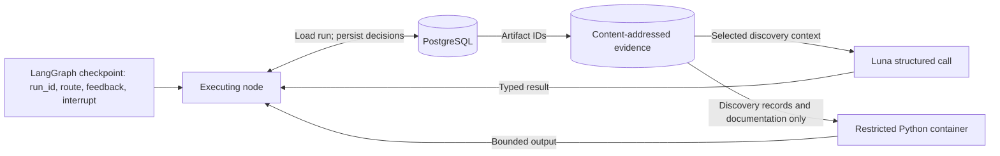

# Engineering notes and verification

[Agent design](#part-2-langgraph-agent-design) · [Implementation](#implementation-notes) · [Verification](#verification-evidence) · [Operations](#operations-and-recovery)

## Part 2: LangGraph agent design

This section describes the implemented graph in [agent.py](../src/link_lens/agent.py), rather than a proposed architecture. It is one bounded workflow with **eight nodes**, three kinds of structured model response and an optional Python investigation. Acquisition/registration happens before the graph; cross-source linking and profile assembly happen afterward.

### Nodes and conditional edges


`build_graph()` registers conditional edges for every node using the returned `state["route"]`; `"end"` maps to LangGraph `END`. The diagram shows the routes the node implementations actually emit. `START` dispatch is distinct from resuming a checkpointed interrupt. Exhausted proposal versions also route to `END` with `needs_review`; this status does not itself create an Inbox approval packet. Wrapped-node exceptions route to `END` with `failed` or `budget_exhausted`; framework interrupts propagate normally. `final` is not wrapped by `safe_node`, so an unexpected exception there surfaces as a graph error.

| Node | Work and model involvement | Saved evidence / next step |
|---|---|---|
| `inspect` | Inspect physical structure; model returns `AnalysisPlan` with reader, grain hypothesis, uncertainty and optional Python. Parse using the proposed reader. | Save analysis and partition artifacts. Reader errors retry up to three structural attempts; success → `explore`. An existing analysis skips reinspection. |
| `explore` | Execute the proposed Python once when present, using up to 300 discovery records and supplied documentation. No model call here. | Save code, bounded output, exit status and duration → `propose`. An existing exploration artifact is reused; an execution failure is retained as feedback, not automatically retried. |
| `propose` | Model returns `MappingSpec`, using discovery examples, ontology, exploration, prior diagnostics and human feedback. Reader must stay frozen. | Save immutable mapping version and hash → `validate`. Malformed output retries `propose`; version/call budgets still apply. |
| `validate` | Run the shared validator on up to 250 validation records; check the reader matches the frozen reader. No model call. | Save diagnostics → `critique` on pass, otherwise `propose`. Bounded examples become feedback data. |
| `critique` | Separate model call returns `SemanticReview` about subject role, ownership, field meaning and evidence. Uses the same configured model, not an independent ground-truth judge. | Save critique → `final` when acceptable with no blockers, otherwise `propose`. One format retry is allowed; the second malformed critique fails. |
| `final` | Validate the frozen proposal on the next unused slice of up to 100 final records. No model call. | Advance `final_cursor`, save record IDs and report. Pass saves the review packet → `review`; failure ends the attempt without a tuning loop. |
| `review` | Pause with `interrupt()` and an Agent Inbox payload. No model call; config editing is disabled. | Save an idempotent decision tied to the config hash. Accept → `extract`; Respond → `propose` with feedback; Ignore → `END`. |
| `extract` | Verify exact-hash approval, then extract the first up to 1,000 records in source order from the partition pool. No model call. | Save immutable observations, extraction artifact and completed status → `END`. Later cohort assembly is a separate deterministic operation. |

### State: what is checkpointed versus persisted

The graph uses `State(TypedDict, total=False)`, with no message-history reducer. Nodes return partial state updates; large records and configs are retrieved through `run_id` rather than carried in the checkpoint.

| Location | Fields / contents | Purpose |
|---|---|---|
| Graph state | `run_id: str` | Locate the authoritative run, source and snapshot. Required to execute nodes even though the TypedDict allows partial updates. |
| Graph state | `route: str` | Select the next node or `end`; this is a control-flow value, not the run's business status. |
| Graph state | `feedback: str` | Carry malformed-proposal feedback or the human's revision request into `propose`; cleared after a valid proposal is stored. |
| LangGraph checkpoint | State, execution position and pending interrupt | Resume the workflow. The development server supplies the checkpointer; tests can inject one through `build_graph(checkpointer=...)`. |
| PostgreSQL run record | Status, mapping/version, artifact references, validation/critique, final cursor, approval ID, counters and timing | Persist progress, decisions and measurements beyond a single node call. `run_data()` reloads it; `update()` saves changes. |
| PostgreSQL evidence records | Source/snapshot metadata, immutable mappings, approvals, observations and events | Preserve provenance and exact configuration identity. |
| Content-addressed artifacts | Analysis, partitioned records, exploration output, review Markdown and extraction results | Store larger evidence payloads. The agent receives selected context, not arbitrary filesystem access to these artifacts. |



### Tools and typed model responses

The graph controls which operation runs next. There is **no generic `ToolNode` or ReAct tool-selection loop**. [llm.py](../src/link_lens/llm.py) uses `with_structured_output(..., method="function_calling", include_raw=True)` to obtain validated Pydantic responses. The model's optional Python is a field in `AnalysisPlan`; the `explore` node invokes the sandbox wrapper explicitly.

| Interface | Who invokes it? | Input → output / boundary |
|---|---|---|
| `call(..., AnalysisPlan, ..., "inspect")` | `inspect` | Source documentation + structural preview → reader, grain, uncertainties and optional investigation code. |
| `call(..., MappingSpec, ..., "propose_mapping")` | `propose` | Evidence + ontology + bounded feedback → declarative mapping. No embedded extraction Python. |
| `call(..., SemanticReview, ..., "semantic_critique")` | `critique` | Proposal and evidence → acceptability, blockers and warnings. Quality check, not measured accuracy. |
| `inspect_resource()`, `read_records()`, `partition()` | `inspect`, as ordinary Python functions | Snapshot bytes → structural preview, parsed pool and disjoint partitions. Not model-callable filesystem tools. |
| `python_tool()`, traced as `execute_discovery_python` | `explore` | Proposed code + supplied discovery records/documentation → bounded execution output. The container receives no credentials, network, repository or Docker socket. |
| `validate()` | `validate` and `final` | Mapping + designated records → deterministic report. Final-test rows are not supplied to the model for revision. |
| `interrupt()` / resume response | `review` and Agent Inbox | Review packet → Accept, Respond or Ignore. Acceptance binds the stored hash, never returned edited config arguments. |
| `extract()` | `extract`, after approval | Approved mapping + records → observations and issues. No per-record LLM calls. |

**Why this is agentic:** model decisions affect reader choice, exploration code and mapping semantics; actual parser/validation/critique/human feedback changes later proposals. **What is bounded:** default limits are eight mapping versions, fifty model calls, ten Python executions, 9,000,000 input tokens and 2,000,000 output tokens per attempt, plus a 900-second active-time limit and the configured cost budget. Token totals are cumulative across model calls; each call still reserves up to 7,000 output tokens. These are the current defaults; preserved submission runs used the earlier limits of twelve model calls, 100,000 input tokens and 24,000 output tokens. The graph normally offers one optional Python investigation, not ten automatic exploration iterations. Reader and critique repair loops also consume the call budget. A human revision traverses validation and critique again and consumes another unused final slice before fresh approval.

For evidence, inspect [saved onboarding runs](../outputs/onboarding/) and [current approval packets](../outputs/README.md). [Graph tests](../tests/test_graph.py), [budget tests](../tests/test_budgets.py) and [review recovery tests](../tests/test_review_recovery.py) exercise these boundaries. This design reference does not imply every saved source used Python or needed every revision path.

## Implementation notes

**Current approach:** Jev triage + Luna onboarding, completed batch and AI audits. [Live status](../outputs/README.md) and [comparison](../outputs/COMPARISON.md) supersede prior measured outcomes below. Historical examples and acceptance results below describe the preserved Terra baseline unless explicitly dated as the new run.

### Work scope and time

This is the expanded reusable-project implementation requested after the educational walkthrough. Docker services, sandbox broker, Agent Inbox, PostgreSQL and OKF viewer go beyond the assignment's minimum. Do not present this project as six hours of work.

Development began in the preceding active session on 2026-09-17 UTC and continued after a user pause on 2026-09-18 UTC. The complete active development duration was not instrumented from the start and is **unknown**. Container creation times and the long pause are not development-time measurements. Runtime onboarding seconds are separately measured in usage receipts. Subsequent explicitly recorded work intervals belong in `docs/work-log.jsonl`; do not reconstruct precise hours from file timestamps.

### Implemented boundaries

One graph controls inspection, optional isolated exploration, typed proposal, deterministic validation, independent semantic critique, final holdout and mapping-level review. The model has discovery samples and bounded validation feedback. It receives no path/file-reading tool into the repository or full snapshot. The broker accepts supplied discovery records, not a snapshot path. The model does not run the extractor as generated code.

The initial physical reader is frozen before record partitioning. Structural reader errors now return bounded diagnostics to the model for at most three attempts before any partition is frozen. After partitioning, mapping revision cannot change the reader and invalidate the holdout. The seventh-source first attempt predated this repair loop and failed; the corrected run and original failure are both retained.

The initial six form a publisher/format portfolio selected from the generated shortlist. ASIC Credit Licensees is reserved for generalisation. A different resource in the same publisher family is a modest transfer test, not proof of arbitrary-source generalisation.

### Observed engineering failures

1. Docker `put_archive` and `get_archive` do not provide the desired live read/write access to our read-only-root tmpfs setup. Input is now copied with bounded fixed-path exec operations; output is read through a bounded fixed-path exec operation. Agent code still receives no mounts, network or daemon socket.
2. LangGraph file-path imports do not preserve package-relative imports. `langgraph.json` now uses installed module paths.
3. In the installed LangGraph version, `GraphInterrupt` is an Exception. A generic error wrapper initially swallowed it in a deterministic test. It is now explicitly re-raised, and the graph test covers interrupt/revision/resume.
4. Agent Inbox's native Accept response carries `args: null`. The backend binds acceptance to the immutable config at the paused review node. An explicit CLI hash is checked; an edited object never replaces the saved config. Direct config edits are disabled.
5. First live Companies run produced unqualified canonical field names because the tool schema described `canonical_field` as an unrestricted string. Validation rejected all three attempts. The shared contract now exposes the exact ontology enum. Failed calls remain in the usage ledger; the corrected run is a separate attempt.

### Confidence and timestamp policy

Source reliability, field mapping confidence and linking rule score remain separate and uncalibrated. Checksums validate identifier shape, not whether a source assigned it to the correct subject. A publication proxy is not a company-change date. Timezone-naive CKAN timestamps are marked with an explicit UTC assumption. Missing timestamp evidence quarantines records.

### Current scale limits

The implementation uses bounded in-memory source samples, JSON payload tables and individual upserts. It is appropriate for this demonstration, not 15 million companies. At 500 sources the first practical bottlenecks are review throughput and acquisition/schema-drift management, followed by database write batching and index design. Upgrade with object storage, bulk loading, worker leases, typed relational columns/indexes and incremental recomputation before considering a graph database.

6. AFS critique incorrectly claimed an 11-digit ABN could also pass the 9-digit ACN validator. The critique prompt now receives authoritative operation semantics. It remains a fallible check, not ground truth.
7. Date transformations initially allowed DD/MM/YYYY as a string argument, although Python requires `%d/%m/%Y`. The shared typed operation now describes and validates strptime directives.
8. The seventh source initially selected tab despite a coherent comma-delimited preview. A shared pre-partition reader-repair loop and explicit preference for actual-resource evidence were added. The later run reached review in three model calls; this is not an untouched holdout experiment.

## Verification evidence

The promoted expanded-ontology run passed **106 deterministic tests; four gated integrations skipped**. Tests cover immutable ontology versions, legacy replay, exact approvals, held-out separation, scoped grouping, missing financial values, concurrent budget reservations, interruption receipts, cache isolation and archive fixtures. Ruff F and export/link checks passed. [Recorded checks](../outputs/checks.json).

The six approved mappings yield 60 profiles and 61 links, with 79,840 observation occurrences / 79,113 unique claims. Both OKF exports have 1,676 documents, 3,220 citation edges and no broken internal links. Human evidence review remains pending; saved mapping approvals do not measure link precision.

Earlier runtime/checkpoint repairs, Terra/Luna audits, Docker checks and live archive restore measurements are preserved in the [historical engineering guide](../experiments/jev-luna-v1-submission/docs/ENGINEERING.md). They do not establish a live restore or human evaluation for this expanded experiment.

## Operations and recovery

The selected submission configuration is `jev-gpt6-luna-ontology-v1`. Exact promoted run, batch, ontology and snapshot IDs are in `outputs/submission-manifest.json`. Its outputs are in `outputs/`.
The previous deterministic + Terra run remains in `experiments/terra-baseline/`;
`manifest.json` hashes its archived files. Do not overwrite that archive or reuse its approvals.

### Reproduce discovery and onboarding

Compose mounts local `src/` read-only into the backend and sandbox controller. LangGraph's development server and Uvicorn automatically reload Python changes, so routine code edits do not require an image rebuild. The backend also mounts migrations, Alembic configuration, graph configuration and the ontology. These mounts apply only to the trusted services; agent execution containers still receive no repository mount.

After changing Compose configuration, apply it with `docker compose up -d --no-deps backend sandbox-controller`. Dependency or Dockerfile changes still require `docker compose up -d --build backend sandbox-controller`. After editing `.env`, use `docker compose up -d --no-deps --force-recreate backend` to load new environment values. Non-Python configuration changes may require `docker compose restart backend`; restarting also applies new migrations. Reloading restarts the worker, so make edits between active onboarding jobs. PostgreSQL, artifacts and the checkpoint volume remain persistent.

```sh
uv sync --frozen
docker compose up -d --build
uv run link-lens discover
uv run link-lens portfolio
uv run link-lens runs
uv run link-lens onboard RUN_ID
```

`.env` needs `OPENROUTER_API_KEY` for Jev and the existing Azure `OPENAI_API_KEY` / `OPENAI_API_BASE` for Luna. New defaults are `LINK_LENS_MODEL=gpt-6-luna` and `LINK_LENS_EXPERIMENT_ID=jev-gpt6-luna-ontology-v1`; existing `.env` settings override them. Optional LangSmith settings apply. No secrets are written to reports. Onboard each new portfolio run ID once; the portfolio command skips existing runs in the same experiment. To start a separate experiment, choose a new experiment ID consistently in host and backend environments before starting.

Discovery scores all supported-format candidates using Jev. The combined rank is 50% existing rule score + 50% Jev relevance. Publisher cap: eight; shortlist: fifty. This is a disclosed heuristic, not a calibrated relevance probability. There is no audit-label feedback into ranking. Saved successful decisions are reused on retry; failed calls retain usage receipts and cannot silently become successful scores.

### Review the current configs

Open [Agent Inbox](http://localhost:3000) or use the source links in [the current overview](../outputs/README.md). Review the exact new Luna-generated configs. Accept, Respond, or Ignore. Old Terra approvals never approve new configs.

A run at `needs_review` or `failed` has not passed the workflow and is not ready to accept. Its errors must be diagnosed; a fresh bounded run retains a `supersedes_run_id` link and all old costs. No automatic fallback to Terra, hand-edited mapping, hidden budget reset or test-set-guided repair is used.

### After all six current configs are accepted

The submitted runs have already completed. For an independent rerun, select explicit completed run IDs, assemble, then enhance in a separate output directory:

```sh
uv run link-lens assemble RUN_1 RUN_2 RUN_3 RUN_4 RUN_5 RUN_6 --cohort-pool-size 25000
uv run link-lens export --batch-id BASELINE_BATCH_ID --output outputs/local-run/new-run/baseline
uv run link-lens enhance --batch-id BASELINE_BATCH_ID --retrieval hybrid --reconcile --output outputs/local-run/new-run/enhanced
```

The old `report_current_experiment.py`, `finish_current_experiment.py` and authored audit scripts describe earlier experiments. Do not run them against the promoted submission. Mapping approval, evidence evaluation and submission promotion are separate decisions. No archived labels approve new evidence.

### Recovering a requested revision after its attempt budget is exhausted

For an attempt that stopped before reaching Inbox (`needs_review`, `budget_exhausted` or `failed`), prepare a replacement with explicit feedback:

```sh
uv run link-lens recover STOPPED_RUN_ID --feedback "Correct the semantic critique; leave unsupported claims unmapped."
uv run link-lens onboard NEW_RUN_ID
```

`recover` prints the replacement ID and exact next command without making model calls. It requires the same configured experiment and model, a frozen reader/partitions, and unused final-test records. It carries the existing mapping, validation and critique into a fresh bounded attempt, preserves the maximum consumed final cursor for the snapshot, and records `supersedes_run_id` and the recovery request. Old attempts and their costs remain unchanged. Repeating the same recovery request returns the existing replacement. Final-test failures cannot be recovered this way. The replacement must pass validation and receive fresh human approval; recovery is not approval.

Choose feedback based on the stop reason, visible with `uv run link-lens runs --run-id STOPPED_RUN_ID`:

| Stop reason | Suggested `--feedback` |
|---|---|
| Semantic critique or exhausted mapping revisions | `Address the previous semantic critique. Correct mappings only where supported by source evidence; leave unsupported or ambiguous fields unmapped. Preserve mappings that remain valid.` |
| Temporary API or sandbox failure, after fixing its cause | `Retry after the temporary infrastructure failure. Preserve the existing reader and supported mappings.` |
| Specific unsupported mapping | `EXAD includes external administration and receivership, not only liquidation. Map EXAD to unknown or leave it unmapped. Preserve other supported mappings.` |

`Retry to onboard` is accepted, but gives little direction. Prefer actionable feedback; the previous critique is already carried forward. For budget exhaustion, diagnose the cause first: a replacement has the same configured limits and may fail again. A `needs_review` run may have stopped without an Inbox interrupt; only review-ready runs reach `waiting_for_human`.

When the user has actually requested a revision, a stopped attempt can be replaced explicitly:

```sh
uv run python scripts/recover_review_revisions.py EXHAUSTED_RUN_ID
uv run link-lens usage
```

The script requires a recorded revision request, preserves the frozen partitions and consumed final-test cursor, links `supersedes_run_id`, and carries forward the generated configuration and semantic critique. It does not approve anything. Repeated execution returns the existing replacement instead of launching duplicates. Original token/version bounds are not increased; the new bounded attempt and all prior costs remain visible. The latest interrupted review needs a fresh Accept decision.

### Completed run and saved demonstration

All six runs in `outputs/current-run.json` are approved. The selected enhanced batch contains 60 profiles and 61 links. Open `outputs/okf/viewer.html` or the published Pages site. Human evidence evaluation remains pending. Historical database ZIPs reproduce earlier experiments, not this submission; full new-experiment archive restoration is unverified.

The [experiment archive](../experiments/jev-gpt6-luna-ontology-v1/README.md) preserves deterministic and enhanced exports. [The previous submission](../experiments/jev-luna-v1-submission/outputs/README.md) retains its original counts, approvals, audits and checksums. Large JSONL exports are losslessly compressed with SHA-256 manifests; the viewer is uncompressed HTML. The promotion manifest records the exact approved viewer hash.

## Experimental hybrid enhancement

`enhance` runs after mapping approval and extraction. It reads an immutable batch,
reuses its exact selected record IDs, and publishes a new experimental batch. It
neither re-onboards sources nor modifies submission artifacts. Older batches without
candidate metadata are reconstructed from their approved mappings/snapshots; every
reconstructed observation must equal the frozen observation before inference starts.

```sh
# Read-only evidence coverage, no model calls:
uv run link-lens enhance --batch-id BASELINE_BATCH_ID --preflight-only
# Bounded paid assessment, with progress on stderr:
uv run link-lens enhance --batch-id BASELINE_BATCH_ID --max-pairs 50
# Lexical-only retrieval ablation; still uses Jev for identity decisions:
uv run link-lens enhance --batch-id BASELINE_BATCH_ID --retrieval fuzzy --no-reconcile \
  --output outputs/local-run/fuzzy-enhancement
uv run link-lens enhance-worksheet --batch-id DERIVED_BATCH_ID
# After a human labels the combined worksheet, evaluate one frozen split:
uv run link-lens enhance-evaluate --batch-id DERIVED_BATCH_ID \
  --labels outputs/local-run/enhancement-review/worksheet.json --split heldout
```

Replace placeholders with stored batch IDs. Enhancement commands without `--preflight-only` make paid calls;
worksheet generation and evaluation do not. Provider requirements are OpenRouter
access to the configured Jev model, an OpenAI-compatible embedding endpoint exposing
`text-embedding-3-small`, and the configured onboarding model for conflict annotations.
Optional `LINK_LENS_EMBEDDING_API_BASE` and `LINK_LENS_EMBEDDING_API_KEY` override the
normal OpenAI endpoint/key. `.env.example` documents all enhancement settings.

Implementation entry points:

- `enhancement.py`: frozen input reconstruction, orchestration, immutable derived
  batches, source-impact replay and separate exports.
- `semantic_resolution.py`: labelled evidence packets, RapidFuzz name retrieval,
  local cosine retrieval, eligibility gates and cluster construction.
- `enhancement_models.py`: Jev, embeddings and structured conflict annotations;
  typed contracts live in `enhancement_contracts.py`.
- `reconciliation.py`: complete-pair equivalence groups and original-value provenance.
- `enhancement_evaluation.py`: human worksheets and benchmark reports.

Each record retrieves up to 20 candidates per other source per retrieval method.
Policy `hybrid-evidence-2` uses initial 0.80 fuzzy and cosine retrieval floors; these
are experimental retrieval filters, not identity confidence thresholds. Fuzzy and
embedding sets are unioned. Embeddings default to 1,536 dimensions and batches of
64 inputs; unchanged individual vectors from the first policy remain reusable.

Assessment and admission are separate. Sparse candidates can be assessed by Jev
and exported for human review, but matching names alone cannot create membership.
Potential admission routes include an entity website domain, compatible full
registered/business addresses, or an exact distinctive name plus matching locality,
state and postcode with registered/business roles. An explicitly co-stated legal /
trading alias can accompany that location evidence. Service-location evidence needs
an exact distinctive name, matching full address and postcode, compatible roles,
and clear ownership. Conflicting location components block the alternative routes.
These combinations are experimental: neither a postcode nor industry alone suffices.
Frequency features flag repeated names, domains and addresses.
Jev separately judges identity, name compatibility, corroboration and ownership.
The same-entity score and all three supporting judgments must reach 0.98, with a
0.10 identity margin. These are versioned experimental thresholds.

Exact clusters remain anchors. New attachments require direct support from an
original anchor record. A component spanning existing IDs is deferred as a whole.
Without an anchor, every cross-source pair must qualify; missing, failed or unqueried
edges never establish transitive identity. Provisional IDs are deterministic at
creation and retained by explicit record membership on subsequent derived batches.
Passing pair decisions can still be deferred by cluster checks; inspect both exports.

The default enhancement limit is $10 per stable job, additionally bounded by the shared experiment cap, six concurrent requests and
two retries per failed request. At most 500 new identity pairs are attempted per
invocation (`--max-pairs` overrides this); successful cached decisions do not count.
Potential admission routes are prioritized, followed by exact names and retrieval
scores. Remaining pairs stay pending, never classified as nonmatches. Repeating the
same command assesses the next uncached pairs within the cumulative dollar budget.
`--max-pairs` limits identity assessment only; embeddings and reconciliation also
consume the shared budget. Progress reports stages, cache hits and attempts to stderr;
`--no-progress` disables it and stdout remains the final JSON result.

Job identity binds the parent artifact and policy;
retrying the same command retains spend. Each request reserves cost under the shared
PostgreSQL advisory lock before dispatch; interrupted/unknown attempts retain their
reservation. Reservations are not measured bills. Successful responses cache by
complete request, endpoint, model and protocol version. Changing evidence invalidates
cache reuse. The provider-reported model, usage, request/response artifacts, failures
and timing are saved. Unknown usage stays unpriced. Changing a provider behind the
same endpoint/model alias requires a policy-version change to deliberately invalidate
cached responses. The dollar gate is based on saved provider rate estimates, not an
invoice guarantee.

Budget exhaustion or provider failure produces explicit pending work. Re-run with
the same parent and policy to reuse successful calls; an explicit `--budget` raises
the job ceiling without resetting historical charges; the shared experiment cap still applies. New parent batches
create new jobs with explicit lineage. Policy v2 also creates a distinct job and budget
from v1, while reusing unchanged embedding and profile caches. Identity prompt changes
invalidate the old decision cache. `--no-reconcile` disables model profile work.
No inference is silently replaced with a positive or negative label.

Source-removal analysis applies the same hybrid policy and allows only identical
cached model inputs. Removing a source can change frequency evidence and require new
judgments: those reports are marked incomplete with unknown membership-change metrics.
This analysis never silently spends on fresh counterfactual calls or falls back to
exact-only resolution. Profile-value effects keep original membership fixed.

The experimental export includes candidate/cluster decisions, pending work, entities,
links, profiles, observations, selection, policy, cost receipts and comparison data.
`review_candidates.jsonl` contains unreviewed deferred candidates and their evidence;
`preflight.json` reports source coverage and potential lexical corroboration routes.
Preflight does not retrieve embeddings or estimate accuracy. With no routes it warns
that assessment may produce review candidates without additional links or profiles.
Default destination: `outputs/local-run/enhanced-v2/`. Submission destinations and
`experiments/` are rejected before inference. PostgreSQL stores enhanced entity
snapshots under batch ownership; ordinary `assemble` reads only canonical `entity`
records. Existing domain tables suffice; there is no database schema migration.

### Human evaluation of enhancements

The worksheet samples retrieved and outside-candidate pairs separately, records the
sampling population, and assigns entire known/provisional entity groups to one
split. Development/heldout convenience files accompany the combined worksheet;
retain the combined worksheet for evaluation so leakage can be checked across both.
For uncertain identities, a human must correct grouping before interpreting split
independence. Same-entity human labels require common entity groups. Any record or
entity group occurring in both splits is rejected.

Use `same`, `different`, `unknown`, or leave `label` null. Every human label requires
`reviewer`, `reviewed_at` and `evidence_notes`. Inspect raw locators and address/subject
roles, including shared premises/domains, brands, branches and ambiguous ownership.
Identifier-masked controls are explicitly separate from human ground truth; do not
copy their expected identity into human labels. No evaluation labels are supplied to
inference. Freeze the policy before heldout review; do not tune against heldout labels.

Reports show labelled-benchmark retrieval recall, linkage precision/recall, additional
correct matches, contaminating labelled pairs and a Wilson precision interval.
Unknown/unreviewed items are excluded. These stratified benchmark metrics do not
estimate population performance. Observed semantic precision of 99% is a target,
not an automatic promotion switch. The user explicitly promoted the bounded run into the submission. Its live cost and contribution measurements are in [the results](../outputs/README.md); human accuracy remains unmeasured.

Provider references: [OpenAI embeddings](https://developers.openai.com/api/docs/guides/embeddings),
[embedding pricing](https://developers.openai.com/api/docs/models/text-embedding-3-small),
[Jev typed decisions](https://openrouter.ai/docs/guides/community/jev-tutorial),
[TypeSafe confidence](https://docs.typesafe.ai/confidence).


## Experimental ontology evolution

Run `uv run alembic upgrade head` before using the registry. New tables store immutable
ontology documents, proposal/activation evidence and experiment-wide API reservations.
The packaged v0.1 ontology preserves old mappings and approval hashes. The promoted root `firmable_ontology.yaml` seeds a new experiment when no active version exists; an existing experiment pin always takes precedence. New mappings
include `ontology_hash`; changing its meaning requires a new mapping and approval.
Experimental additions cannot redefine or remove a parent concept.

Use the same environment in the host CLI and backend, without overwriting `.env`:

```sh
export LINK_LENS_EXPERIMENT_ID=jev-gpt6-luna-ontology-v1
export LINK_LENS_MODEL=gpt-6-luna
export LINK_LENS_MAX_COST_USD=10
docker compose up -d backend
```

After discovery and registration, prepare each selected run before starting its graph:

```sh
uv run link-lens ontology prepare --run-id RUN_1 --run-id RUN_2
uv run link-lens ontology propose --run-id RUN_1 --run-id RUN_2 --activate-experimental
uv run link-lens ontology show ONTOLOGY_HASH
uv run link-lens ontology diff PARENT_HASH ONTOLOGY_HASH
uv run link-lens ontology budget
uv run link-lens onboard RUN_1
```

Repeat `--run-id` for all six sources. `prepare` performs paid reader inference and
freezes partitions; it does not propose mappings. `propose` reads only discovery
records and publisher documentation. It makes at most one source proposal each,
one consolidation, at most one structural repair, and a critique deciding each concept individually. Successful responses
are cached by complete evidence, model, prompt and schema. A failed API attempt stays
in the ledger. A rejected job remains rejected; do not silently loop against it.

The proposal artifact records one disposition per source header: `existing_target`,
`new_concept`, `insufficient_evidence`, or `non_domain_metadata`. Literal evidence
quotes must exist in the input. The model receives short source aliases bound to stored run IDs by the engine. Semantic critique remains an AI judgment, not human
validation. Rejected concepts and concepts depending on rejected companions remain unmapped; independently accepted additions can activate together. Successful activation updates only selected unstarted runs and the
experiment's ontology pointer. It never rewrites the submitted YAML or accepts a mapping.
`ontology promote HASH --reviewer NAME` records a human decision on that exact version;
it does not publish artifacts or approve source mappings.

Definitions specify type, scope, cardinality, numeric bounds and required companion
concepts. Scoped fields use a mapping `group` name; the engine derives group identity
from source/record/group, preserving each row's bundle. Financial claims require their
period and currency when declared as companions; absent values quarantine dependent
claims. Decimal values remain exact JSON strings, integers/booleans use JSON scalar
types, and all retain raw values. `indicator_categories` takes named source columns,
a column-to-category `values` mapping and an exact truth marker in `argument`.
Blank input never becomes zero. Generated Python is not an extraction mechanism.
Scoped groups are exported intact and excluded from cross-record reconciliation
and the identity judge's observation payload. They are not additional identifier-linking
rules. Unlinked source claims remain visible. Embedding cache keys retain ontology
hashes, while provider input excludes those hashes and serialization metadata so
that shared cache metadata cannot influence semantic similarity. This serialization
uses `hybrid-evidence-2`; older vectors and their paid-call receipts are retained.

The shared ledger reserves conservative model cost before every request, under the
existing database advisory lock. It includes Jev discovery, ontology, onboarding,
embedding, Jev enhancement and LLM explanations, including failed/retried attempts.
Unknown usage retains its reservation. Completed calls use reported cost when present,
otherwise conservative token rates. `LINK_LENS_PRICING_MULTIPLIER` defaults to 1.0;
set it to the provider's documented uplift, e.g. 1.1 for applicable regional processing.
The $10 cap is an estimate, not an invoice guarantee. Existing call/token/time limits
and the enhancement job cap still apply. An exhausted shared budget stops new calls;
creating another job in the same experiment does not reset it.

After exact mapping approvals, assemble and export a deterministic batch, then run
`enhance --batch-id BATCH_ID --retrieval hybrid --reconcile` with the same experiment
and model environment. Preserve baseline and enhanced exports in separate directories.
Reports include ontology snapshots, proposals, usage and budget state. Human mapping
reviews and human evaluation worksheets must not be replaced by AI approvals.

Once both exports exist, measure concept emission, profile contribution and evidence
consistency without making model calls or changing the submission:

```sh
uv run python scripts/report_ontology_experiment.py --root experiments/jev-gpt6-luna-ontology-v1
```

The report compares the preserved submission, new deterministic assembly and enhanced
assembly separately. It checks observation bindings, profile citations, scoped bundles,
OKF links and identical baseline/enhancement selections. Results and remaining human
evaluation work are recorded in the [experiment report](../experiments/jev-gpt6-luna-ontology-v1/README.md).
