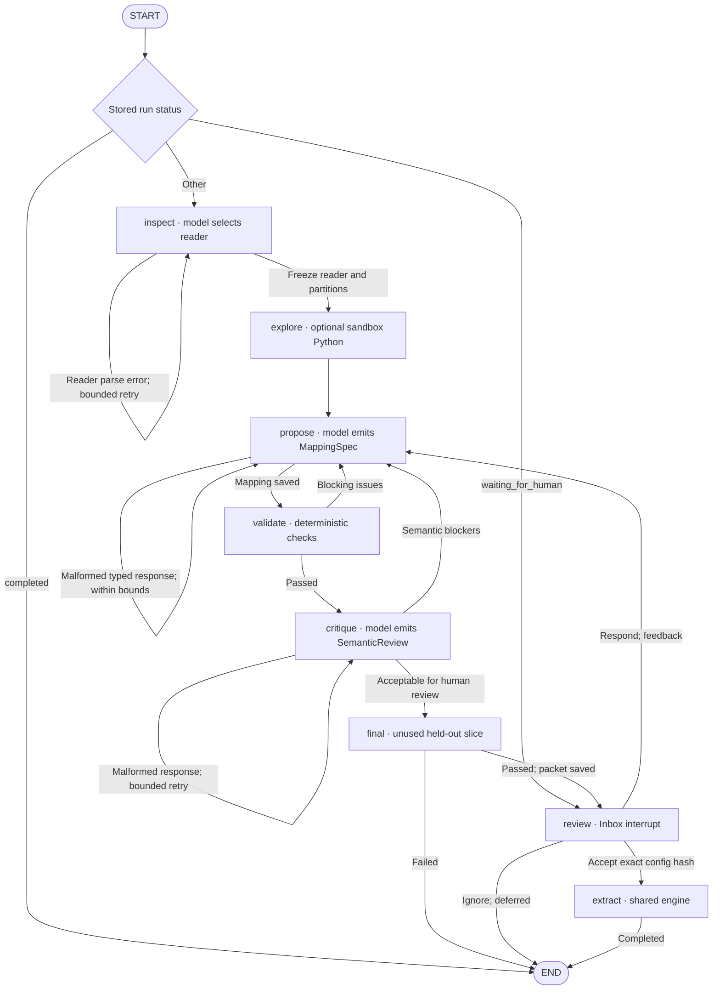
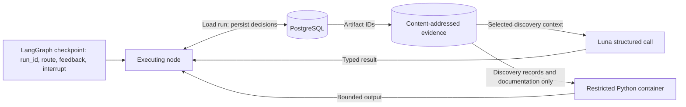

# Engineering notes and verification

[Agent design](#part-2-langgraph-agent-design) · [Implementation](#implementation-notes) · [Verification](#verification-evidence) · [Operations](#operations-and-recovery)

## Part 2: LangGraph agent design

This section describes the implemented graph in [agent.py](../src/link_lens/agent.py), rather than a proposed architecture. It is one bounded workflow with **eight nodes**, three kinds of structured model response and an optional Python investigation. Acquisition/registration happens before the graph; cross-source linking and profile assembly happen afterward.

### Nodes and conditional edges



`build_graph()` registers conditional edges for every node using the returned `state["route"]`; `"end"` maps to LangGraph `END`. The diagram shows the routes the node implementations actually emit. `START` dispatch is distinct from resuming a checkpointed interrupt. Exhausted proposal versions also route to `END` with `needs_review`; this status does not itself create an Inbox approval packet. Wrapped-node exceptions route to `END` with `failed` or `budget_exhausted`; framework interrupts propagate normally. `final` is not wrapped by `safe_node`, so an unexpected exception there surfaces as a graph error.

| Node | Work and model involvement | Saved evidence / next step |
|---|---|---|
| `inspect` | Inspect physical structure; model returns `AnalysisPlan` with reader, grain hypothesis, uncertainty and optional Python. Parse using the proposed reader. | Save analysis and partition artifacts. Reader errors retry up to three structural attempts; success → `explore`. An existing analysis skips reinspection. |
| `explore` | Execute the proposed Python once when present, using up to 300 discovery records and supplied documentation. No model call here. | Save code, bounded output, exit status and duration → `propose`. An existing exploration artifact is reused; an execution failure is retained as feedback, not automatically retried. |
| `propose` | Model returns `MappingSpec`, using discovery examples, ontology, exploration, prior diagnostics and human feedback. Reader must stay frozen. | Save immutable mapping version and hash → `validate`. Malformed output retries `propose`; version/call budgets still apply. |
| `validate` | Run the shared validator on up to 250 validation records; check the reader matches the frozen reader. No model call. | Save diagnostics → `critique` on pass, otherwise `propose`. Bounded examples become feedback data. |
| `critique` | Separate model call returns `SemanticReview` about subject role, ownership, field meaning and evidence. Uses the same configured model, not an independent ground-truth judge. | Save critique → `final` when acceptable with no blockers, otherwise `propose`. One format retry is allowed; the second malformed critique fails. |
| `final` | Validate the frozen proposal on the next unused slice of up to 100 final records. No model call. | Advance `final_cursor`, save record IDs and report. Pass saves the review packet → `review`; failure ends the attempt without a tuning loop. |
| `review` | Pause with `interrupt()` and an Agent Inbox payload. No model call; config editing is disabled. | Save an idempotent decision tied to the config hash. Accept → `extract`; Respond → `propose` with feedback; Ignore → `END`. |
| `extract` | Verify exact-hash approval, then extract the first up to 1,000 records in source order from the partition pool. No model call. | Save immutable observations, extraction artifact and completed status → `END`. Later cohort assembly is a separate deterministic operation. |

### State: what is checkpointed versus persisted

The graph uses `State(TypedDict, total=False)`, with no message-history reducer. Nodes return partial state updates; large records and configs are retrieved through `run_id` rather than carried in the checkpoint.

| Location | Fields / contents | Purpose |
|---|---|---|
| Graph state | `run_id: str` | Locate the authoritative run, source and snapshot. Required to execute nodes even though the TypedDict allows partial updates. |
| Graph state | `route: str` | Select the next node or `end`; this is a control-flow value, not the run's business status. |
| Graph state | `feedback: str` | Carry malformed-proposal feedback or the human's revision request into `propose`; cleared after a valid proposal is stored. |
| LangGraph checkpoint | State, execution position and pending interrupt | Resume the workflow. The development server supplies the checkpointer; tests can inject one through `build_graph(checkpointer=...)`. |
| PostgreSQL run record | Status, mapping/version, artifact references, validation/critique, final cursor, approval ID, counters and timing | Persist progress, decisions and measurements beyond a single node call. `run_data()` reloads it; `update()` saves changes. |
| PostgreSQL evidence records | Source/snapshot metadata, immutable mappings, approvals, observations and events | Preserve provenance and exact configuration identity. |
| Content-addressed artifacts | Analysis, partitioned records, exploration output, review Markdown and extraction results | Store larger evidence payloads. The agent receives selected context, not arbitrary filesystem access to these artifacts. |



### Tools and typed model responses

The graph controls which operation runs next. There is **no generic `ToolNode` or ReAct tool-selection loop**. [llm.py](../src/link_lens/llm.py) uses `with_structured_output(..., method="function_calling", include_raw=True)` to obtain validated Pydantic responses. The model's optional Python is a field in `AnalysisPlan`; the `explore` node invokes the sandbox wrapper explicitly.

| Interface | Who invokes it? | Input → output / boundary |
|---|---|---|
| `call(..., AnalysisPlan, ..., "inspect")` | `inspect` | Source documentation + structural preview → reader, grain, uncertainties and optional investigation code. |
| `call(..., MappingSpec, ..., "propose_mapping")` | `propose` | Evidence + ontology + bounded feedback → declarative mapping. No embedded extraction Python. |
| `call(..., SemanticReview, ..., "semantic_critique")` | `critique` | Proposal and evidence → acceptability, blockers and warnings. Quality check, not measured accuracy. |
| `inspect_resource()`, `read_records()`, `partition()` | `inspect`, as ordinary Python functions | Snapshot bytes → structural preview, parsed pool and disjoint partitions. Not model-callable filesystem tools. |
| `python_tool()`, traced as `execute_discovery_python` | `explore` | Proposed code + supplied discovery records/documentation → bounded execution output. The container receives no credentials, network, repository or Docker socket. |
| `validate()` | `validate` and `final` | Mapping + designated records → deterministic report. Final-test rows are not supplied to the model for revision. |
| `interrupt()` / resume response | `review` and Agent Inbox | Review packet → Accept, Respond or Ignore. Acceptance binds the stored hash, never returned edited config arguments. |
| `extract()` | `extract`, after approval | Approved mapping + records → observations and issues. No per-record LLM calls. |

**Why this is agentic:** model decisions affect reader choice, exploration code and mapping semantics; actual parser/validation/critique/human feedback changes later proposals. **What is bounded:** default limits are three mapping versions, fifty model calls, ten Python executions, 9,000,000 input tokens and 2,000,000 output tokens per attempt, plus a 900-second active-time limit and the configured cost budget. Token totals are cumulative across model calls; each call still reserves up to 7,000 output tokens. These are the current defaults; preserved submission runs used the earlier limits of twelve model calls, 100,000 input tokens and 24,000 output tokens. The graph normally offers one optional Python investigation, not ten automatic exploration iterations. Reader and critique repair loops also consume the call budget. A human revision traverses validation and critique again and consumes another unused final slice before fresh approval.

For evidence, inspect [saved onboarding runs](../outputs/onboarding/) and [current approval packets](../outputs/README.md). [Graph tests](../tests/test_graph.py), [budget tests](../tests/test_budgets.py) and [review recovery tests](../tests/test_review_recovery.py) exercise these boundaries. This design reference does not imply every saved source used Python or needed every revision path.

## Implementation notes

**Current approach:** Jev triage + Luna onboarding, completed batch and AI audits. [Live status](../outputs/README.md) and [comparison](../outputs/COMPARISON.md) supersede prior measured outcomes below. Historical examples and acceptance results below describe the preserved Terra baseline unless explicitly dated as the new run.

### Work scope and time

This is the expanded reusable-project implementation requested after the educational walkthrough. Docker services, sandbox broker, Agent Inbox, PostgreSQL and OKF viewer go beyond the assignment's minimum. Do not present this project as six hours of work.

Development began in the preceding active session on 2026-09-17 UTC and continued after a user pause on 2026-09-18 UTC. The complete active development duration was not instrumented from the start and is **unknown**. Container creation times and the long pause are not development-time measurements. Runtime onboarding seconds are separately measured in usage receipts. Subsequent explicitly recorded work intervals belong in `docs/work-log.jsonl`; do not reconstruct precise hours from file timestamps.

### Implemented boundaries

One graph controls inspection, optional isolated exploration, typed proposal, deterministic validation, independent semantic critique, final holdout and mapping-level review. The model has discovery samples and bounded validation feedback. It receives no path/file-reading tool into the repository or full snapshot. The broker accepts supplied discovery records, not a snapshot path. The model does not run the extractor as generated code.

The initial physical reader is frozen before record partitioning. Structural reader errors now return bounded diagnostics to the model for at most three attempts before any partition is frozen. After partitioning, mapping revision cannot change the reader and invalidate the holdout. The seventh-source first attempt predated this repair loop and failed; the corrected run and original failure are both retained.

The initial six form a publisher/format portfolio selected from the generated shortlist. ASIC Credit Licensees is reserved for generalisation. A different resource in the same publisher family is a modest transfer test, not proof of arbitrary-source generalisation.

### Observed engineering failures

1. Docker `put_archive` and `get_archive` do not provide the desired live read/write access to our read-only-root tmpfs setup. Input is now copied with bounded fixed-path exec operations; output is read through a bounded fixed-path exec operation. Agent code still receives no mounts, network or daemon socket.
2. LangGraph file-path imports do not preserve package-relative imports. `langgraph.json` now uses installed module paths.
3. In the installed LangGraph version, `GraphInterrupt` is an Exception. A generic error wrapper initially swallowed it in a deterministic test. It is now explicitly re-raised, and the graph test covers interrupt/revision/resume.
4. Agent Inbox's native Accept response carries `args: null`. The backend binds acceptance to the immutable config at the paused review node. An explicit CLI hash is checked; an edited object never replaces the saved config. Direct config edits are disabled.
5. First live Companies run produced unqualified canonical field names because the tool schema described `canonical_field` as an unrestricted string. Validation rejected all three attempts. The shared contract now exposes the exact ontology enum. Failed calls remain in the usage ledger; the corrected run is a separate attempt.

### Confidence and timestamp policy

Source reliability, field mapping confidence and linking rule score remain separate and uncalibrated. Checksums validate identifier shape, not whether a source assigned it to the correct subject. A publication proxy is not a company-change date. Timezone-naive CKAN timestamps are marked with an explicit UTC assumption. Missing timestamp evidence quarantines records.

### Current scale limits

The implementation uses bounded in-memory source samples, JSON payload tables and individual upserts. It is appropriate for this demonstration, not 15 million companies. At 500 sources the first practical bottlenecks are review throughput and acquisition/schema-drift management, followed by database write batching and index design. Upgrade with object storage, bulk loading, worker leases, typed relational columns/indexes and incremental recomputation before considering a graph database.

6. AFS critique incorrectly claimed an 11-digit ABN could also pass the 9-digit ACN validator. The critique prompt now receives authoritative operation semantics. It remains a fallible check, not ground truth.
7. Date transformations initially allowed DD/MM/YYYY as a string argument, although Python requires `%d/%m/%Y`. The shared typed operation now describes and validates strptime directives.
8. The seventh source initially selected tab despite a coherent comma-delimited preview. A shared pre-partition reader-repair loop and explicit preference for actual-resource evidence were added. The later run reached review in three model calls; this is not an untouched holdout experiment.

### Inbox resume and checkpoint recovery

The first real ACNC Accept failed before any graph node ran: Agent Server passed a null `goto` into LangGraph's command branch. More seriously, runtime-inmem 0.34.1 registered temporary serializer dictionaries over the shared checkpoint dictionaries in its periodic flush registry. Thread metadata survived but checkpoints did not. Earlier in-process checks did not establish disk durability.

`runtime_compat.py` normalizes resume commands to an empty `goto` list and re-registers the actual shared checkpoint dictionaries after saver construction. This is a narrow compatibility guard for the locked versions, not a custom graph checkpointer. A graph entry route can reconstruct a pending review from its immutable PostgreSQL mapping/packet without another inference or altered config. The user's ACNC acceptance is recovered only against the same config they reviewed. Pending other mappings remain unapproved.

### Final real-data processing

After all human approvals, the initial 5,000-row pools yielded only 23 cross-source entities. The same approved configs processed up to 25,000 rows of the same immutable snapshots for cohort selection, without changing or exposing inference holdouts. The final six-source sample has 1,000 rows each: 20,851 observations, 50 links, 5,535 unlinked candidates and 50 profiles. Expansion is explicitly recorded in the batch, not hidden as representative sampling. Human labels remain pending.

### Initial Jev + Luna rerun (historical, before download gate)

The initial Jev approach used Jev on 213 supported-format candidates out of 945 catalogue records. 943 catalogue IDs match the baseline; two changed in each direction. The computed shortlist retains 28 baseline entries and replaces 22. All six portfolio snapshots have the same hashes as the baseline. The independent new census supports 36 entries, leaves 14 unresolved and confirms no negatives; more unknowns prevent interpreting that as perfect or improved precision.

Initial Luna failures are retained: Companies duplicated/conflicted unmapped columns; Business Names exhausted revisions over subject ownership; AFS omitted a required critique response field, then a later attempt mishandled the International country sentinel and received speculative critique demands. Shared feedback now names conflicting/duplicate columns, describes dictionary-shaped exploration input, explains engine-emitted envelopes and record/role semantics, and retries malformed critique output at most once. Fresh bounded runs supersede failed attempts; all remain in the experiment ledger. These improvements mean the before/after comparison is not model-only. No final-test feedback was used for the retries, no mappings were hand-edited, and review/abstention requirements were not weakened.

Five successful mappings reached review before the final AFS retry. See the generated overview for current state, rather than treating this historical progress note as a live counter.

### Review recovery

The reviewer sent the Companies-specific revision request to all six sources. Companies v3 and Business Names v2 subsequently received actual Accept decisions and extracted. Four other attempts exhausted their original bounds. `scripts/recover_review_revisions.py` creates explicitly linked replacement attempts only after a recorded user revision request; it preserves immutable partitions, generated config context, and the maximum consumed final-slice cursor for that snapshot. Each fresh attempt is still bounded; aggregate experiment costs include predecessors. Replacement configs require another exact-hash human approval. This is disclosed assisted recovery, not a first-pass success claim.

A second review pass approved ATO and Employment. ACNC and AFS received review-note summaries as Respond messages, again requesting revision rather than approval. Two explicitly linked replacement attempts were created with consumed final cursors retained. The review guide now distinguishes reading reminders from revision instructions and identifies the Accept action. These additional calls remain part of the current experiment, not omitted as user wait.

### Completed Jev + Luna batch

All six final mappings are user-approved. Batch `fa5523f0-7d5a-41d2-af42-59e6362e3046`: 20,838 observations, 52 links, 5,543 unlinked records, 52 profiles. AI audits cover all 50 shortlisted datasets (47 supported, 1 unsupported, 2 unresolved after the download-gate revision) and all 52 links (52 supported). Human evaluation remains incomplete. OKF has 539 documents, 962 edges and no broken internal links. Earlier progress/failed-attempt notes are historical; [the overview](../outputs/README.md) is the final status entry point.

Presentation references: [illustrated demo](DEMO.md), [workflow and storage diagrams](../README.md), and [screenshot capture context](images/README.md). The initial Jev shortlist figures above describe the preserved pre-gate run; the current shortlist retains 26 Terra entries and replaces 24.


## Verification evidence

**Current approach:** Jev triage + Luna onboarding, completed batch and AI audits. [Live status](../outputs/README.md) and [comparison](../outputs/COMPARISON.md) supersede prior measured outcomes below. Historical examples and acceptance results below describe the preserved Terra baseline unless explicitly dated as the new run.

Status after mapping approvals; human evaluation labels pending. This list distinguishes tested implementation from pending real-data deliverables.

| Check | Evidence / status |
|---|---|
| Services start | Compose backend, frontend, PostgreSQL and broker built and running; HTTP health and Inbox document return 200 |
| Model connectivity | Live structured-output smoke call; 258 input / 20 output tokens recorded |
| Discovery | 945 unique catalogue records, 50 ranked rows; six selected datasets are in the generated shortlist |
| Six agent configs | Seven reviewable configs including the extra source; runtime-generated version history and receipts in outputs |
| Genuine live revision | Business Names, ACNC, ATO, Employment and Companies reached v2; earlier proposals and critiques retained |
| Deliberately invalid proposal | Deterministic graph test injects missing column, runs real validation, revises, interrupts and resumes |
| Reader repair | Deterministic graph test fails a quoted CSV with tab reader, corrects before partition freeze |
| Seventh-source transfer | Corrected Credit Licensees run reached review; first delimiter failure and intervening shared workflow improvement disclosed |
| Persistent review state | Original in-process check was insufficient. After fixing runtime flush registration, seven threads verified after an actual backend restart; six pending reviews and one completed state preserved. |
| Approval/rejection/idempotency | Deterministic tests bind exact hash, reject edits/stale hashes, prevent rejected extraction, and avoid duplicate approvals/observations |
| Actual human approval across restart | ACNC user approval completed: 1,000 rows / 5,998 observations. After compatibility fix, actual backend restart preserved the completed state and six pending review checkpoints. |
| Sandbox boundary | Docker tests verify UID, no key/socket/repository, blocked internet/database connections |
| Sandbox limits | Real timeout kills at 60 seconds and removes container; bounded console; cgroups verify 1 CPU / 1 GiB / 64 PIDs; root write blocked |
| Parsing | Tests cover TSV, quoted CR records, introductory Excel sheet, numeric IDs, leading zeros, missing values and late legacy encoding |
| Linking | Exact ID, conflicting ID, same-name abstention, reporting-group separation, repeated records and stable internal IDs tested |
| Profiles/removal/OKF | 50 synthetic entities through pipeline in an isolated test DB; conflict/provenance/removal and exact OKF serialization/internal links tested |
| Frozen evidence | Actual 25.6 MB archive restored into fresh temporary SQLite: 44,004 records, six approved configs, 50 real profiles and valid OKF re-export with empty model credentials. |
| Actual human precision | Not met: 70 all-Yes responses were submitted without evidence review, as disclosed by the user. Preserved as unreviewed; both metrics remain unknown. |
| Actual 50 profiles | Delivered: 50 real profiles, 20,851 observations and 50 links; OKF 661 concepts / 1,210 edges / zero broken internal links. |
| UI visual interaction | Upstream pinned Inbox built; protocol and HTTP verified. No available browser automation surface for a click-through check |
| Cost | All calls retained, including failures. Azure billing rates unknown, so no dollar total or under-$10 claim |

Run deterministic checks with `uv run pytest -q`. Docker tests require `RUN_DOCKER_TESTS=1`; the timeout test takes one minute. Live inference is opt-in through CLI commands.

Latest deterministic check: 32 passed, 4 Docker-only tests skipped by default. Docker isolation, bounded-output, cgroup limits and timeout checks were run separately.


AI-assisted audit (18 September 2026): all 20 triage items and 50 raw link pairs assessed, with per-item reasoning, resource URLs and snapshot/row references in `outputs/ai-audit/`. Results: 17 relevant / 1 irrelevant / 2 unresolved datasets; 50 supported links. AI labels have a separate storage namespace and report, and the human import command rejects AI-tagged packets. This does **not** close the manual-evaluation acceptance requirement. The all-Yes human selections remain unreviewed; no application accuracy metric counts them.


19 September: AI-only triage coverage extended to all 50 original ranked datasets: 39 relevant, 5 irrelevant, 6 unresolved. Stored as a separate `ai_census` evaluation, with `ai_label` decisions and full evidence under `experiments/terra-baseline/outputs/ai-audit/`. The required 20-item human worksheet and 50-item link worksheet are unchanged, unreviewed and excluded from human accuracy claims. Expanded census does not close the manual-evaluation requirement.

### Jev + Luna initial checks (historical progress, 19 September 2026)

- 945 catalogue records retrieved; 213 Jev decisions succeeded, producing 50 ranked rows with all six portfolio sources included. New audit: 36 supported, zero confirmed negatives, 14 unresolved.
- Luna tool-calling connectivity test succeeded with measured usage.
- Fresh Luna configs require new approval; failed attempts and bounded retries remain in their own experiment ledger. Old approvals are not reused.
- Deterministic suite: 41 passed, four Docker integration tests skipped in this rerun (previous Docker results remain historical).
- Fresh profile/link outputs and all-link evidence audit are pending current mapping approvals. The previous 50/50 link audit does not satisfy the new run's check.

### Completed Jev + Luna batch

All six final mappings are user-approved. Batch `fa5523f0-7d5a-41d2-af42-59e6362e3046`: 20,838 observations, 52 links, 5,543 unlinked records, 52 profiles. AI audits cover all 50 shortlisted datasets (36 supported, 14 unresolved) and all 52 links (52 supported). Human evaluation remains incomplete. OKF has 539 documents, 962 edges and no broken internal links. Earlier progress/failed-attempt notes are historical; [the overview](../outputs/README.md) is the final status entry point.

Final verification: 42 deterministic tests passed, four integration tests skipped; lint passed. All six exact config hashes match stored user approvals. All 52 output link IDs have individual AI judgments. At that verification point, all 798 original baseline archive file hashes were unchanged. The full original archive is now retained locally; the public comparison subset has its own manifest. The current frozen archive contains 534 entries and 527,302,038 uncompressed bytes; every blob hash was verified. The loader's finite limit was raised from 500 MB to 750 MB to accommodate both experiments and their retained audit/failure evidence.

Actual current-archive restore verified in a fresh temporary SQLite database: 84,550 stored records restored, including 20,838 observations, 52 links, 5,543 unlinked records and 52 profiles. Live PostgreSQL was unchanged. The frozen archive restores evidence for browsing, not resumable LangGraph workflow checkpoints.

### Part 1 download gate verification

48 deterministic tests passed, four integration tests skipped. The gate rejects HTTP-200 empty/HTML bodies, ZIP-as-CSV and resource-index CSVs; tests verify rank-preserving replacement, publisher-bound insufficient-candidate failure, public-host checks and discovery revision pointers. Live final revision checked 93 candidates, selected 50 readable resources, and retained all six portfolio sources. AI census: 47 supported / 1 unsupported / 2 unresolved; human review pending. Downstream observation/link/profile/selection/removal files match their saved pre-rerun SHA-256 hashes.


## Operations and recovery

The selected submission configuration is `jev-luna-v1`. Its outputs are in `outputs/`.
The previous deterministic + Terra run remains in `experiments/terra-baseline/`;
`manifest.json` hashes its archived files. Do not overwrite that archive or reuse its approvals.

### Reproduce discovery and onboarding

Compose mounts local `src/` read-only into the backend and sandbox controller. LangGraph's development server and Uvicorn automatically reload Python changes, so routine code edits do not require an image rebuild. The backend also mounts migrations, Alembic configuration, graph configuration and the ontology. These mounts apply only to the trusted services; agent execution containers still receive no repository mount.

After changing Compose configuration, apply it with `docker compose up -d --no-deps backend sandbox-controller`. Dependency or Dockerfile changes still require `docker compose up -d --build backend sandbox-controller`. After editing `.env`, use `docker compose up -d --no-deps --force-recreate backend` to load new environment values. Non-Python configuration changes may require `docker compose restart backend`; restarting also applies new migrations. Reloading restarts the worker, so make edits between active onboarding jobs. PostgreSQL, artifacts and the checkpoint volume remain persistent.

```sh
uv sync --frozen
docker compose up -d --build
uv run link-lens discover
uv run link-lens portfolio
uv run link-lens runs
uv run link-lens onboard RUN_ID
```

`.env` needs `OPENROUTER_API_KEY` for Jev and the existing Azure `OPENAI_API_KEY` / `OPENAI_API_BASE` for Luna. Defaults are `LINK_LENS_MODEL=gpt-5.6-luna` and `LINK_LENS_EXPERIMENT_ID=jev-luna-v1`. Optional LangSmith settings apply. No secrets are written to reports. Onboard each new portfolio run ID once; the portfolio command skips existing runs in the same experiment. To start a separate experiment, choose a new experiment ID consistently in host and backend environments before starting.

Discovery scores all supported-format candidates using Jev. The combined rank is 50% existing rule score + 50% Jev relevance. Publisher cap: eight; shortlist: fifty. This is a disclosed heuristic, not a calibrated relevance probability. There is no audit-label feedback into ranking. Saved successful decisions are reused on retry; failed calls retain usage receipts and cannot silently become successful scores.

### Review the current configs

Open [Agent Inbox](http://localhost:3000) or use the source links in [the current overview](../outputs/README.md). Review the exact new Luna-generated configs. Accept, Respond, or Ignore. Old Terra approvals never approve new configs.

A run at `needs_review` or `failed` has not passed the workflow and is not ready to accept. Its errors must be diagnosed; a fresh bounded run retains a `supersedes_run_id` link and all old costs. No automatic fallback to Terra, hand-edited mapping, hidden budget reset or test-set-guided repair is used.

### After all six current configs are accepted

```sh
# Refresh progress/cost reports without model calls:
uv run python scripts/report_current_experiment.py
# Assemble only after checking the six desired current runs are completed:
uv run python scripts/finish_current_experiment.py
```

The finish command uses the latest run for each portfolio source, verifies every one is completed, assembles with a 25,000-row pool, and exports the new results. It does not accept reviews. It reuses an already assembled batch with identical run IDs. It then creates the 20-dataset and 50-link human worksheets. Actual evidence review remains separate: the assistant must inspect all 50 shortlist datasets and every proposed link, save individual evidence/verdicts and update the comparison. Never import AI judgments as human labels.

Expected final files: shortlist, six approved mappings, observations, links, unlinked queue, profiles, source-removal results, OKF, costs, measurements, full AI audits and the before/after comparison. The current run is complete: 52 links/profiles, all-link AI census finished. Human labels remain incomplete.

The seventh-source guide now uses the current Luna batch and six run IDs. Its saved-prefix recheck found three overlaps with the current 52 profiles. Live seventh-source inference and contribution remain a future demo.

### Recovering a requested revision after its attempt budget is exhausted

For an attempt that stopped before reaching Inbox (`needs_review`, `budget_exhausted` or `failed`), prepare a replacement with explicit feedback:

```sh
uv run link-lens recover STOPPED_RUN_ID --feedback "Correct the semantic critique; leave unsupported claims unmapped."
uv run link-lens onboard NEW_RUN_ID
```

`recover` prints the replacement ID and exact next command without making model calls. It requires the same configured experiment and model, a frozen reader/partitions, and unused final-test records. It carries the existing mapping, validation and critique into a fresh bounded attempt, preserves the maximum consumed final cursor for the snapshot, and records `supersedes_run_id` and the recovery request. Old attempts and their costs remain unchanged. Repeating the same recovery request returns the existing replacement. Final-test failures cannot be recovered this way. The replacement must pass validation and receive fresh human approval; recovery is not approval.

Choose feedback based on the stop reason, visible with `uv run link-lens runs --run-id STOPPED_RUN_ID`:

| Stop reason | Suggested `--feedback` |
|---|---|
| Semantic critique or exhausted mapping revisions | `Address the previous semantic critique. Correct mappings only where supported by source evidence; leave unsupported or ambiguous fields unmapped. Preserve mappings that remain valid.` |
| Temporary API or sandbox failure, after fixing its cause | `Retry after the temporary infrastructure failure. Preserve the existing reader and supported mappings.` |
| Specific unsupported mapping | `EXAD includes external administration and receivership, not only liquidation. Map EXAD to unknown or leave it unmapped. Preserve other supported mappings.` |

`Retry to onboard` is accepted, but gives little direction. Prefer actionable feedback; the previous critique is already carried forward. For budget exhaustion, diagnose the cause first: a replacement has the same configured limits and may fail again. A `needs_review` run may have stopped without an Inbox interrupt; only review-ready runs reach `waiting_for_human`.

When the user has actually requested a revision, a stopped attempt can be replaced explicitly:

```sh
uv run python scripts/recover_review_revisions.py EXHAUSTED_RUN_ID
uv run python scripts/report_current_experiment.py
```

The script requires a recorded revision request, preserves the frozen partitions and consumed final-test cursor, links `supersedes_run_id`, and carries forward the generated configuration and semantic critique. It does not approve anything. Repeated execution returns the existing replacement instead of launching duplicates. Original token/version bounds are not increased; the new bounded attempt and all prior costs remain visible. The latest interrupted review needs a fresh Accept decision.

### Completed run and saved demonstration

All six latest runs in `outputs/current-run.json` are approved. Batch: `fa5523f0-7d5a-41d2-af42-59e6362e3046`. The pipeline yields 52 links/profiles, including two additional matches from filler. All 52 were inspected in the AI census. Open `outputs/okf/viewer.html`; use `demo/jev-luna-v1.zip` for frozen database evidence. Human evaluation remains explicitly incomplete.

Evidence collection is reproducible with `uv run python scripts/collect_current_link_evidence.py`. `scripts/record_current_link_audit.py` persists the assistant's inspected, batch-specific judgments and refuses a different batch; it is not an automatic evaluator for future outputs.

Part 1 was subsequently rerun with a download/reader gate, using cached catalogue/Jev scores and no new model calls. Current audit: 47 supported, 1 unsupported, 2 unresolved. Parts 2–4 are unchanged. [Evidence, scope and commands](../outputs/part1-downloadable/REPORT.md).
