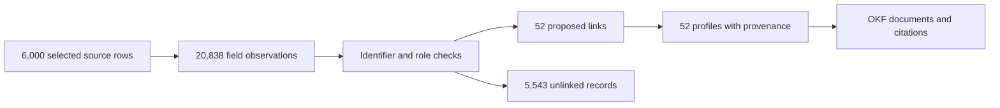
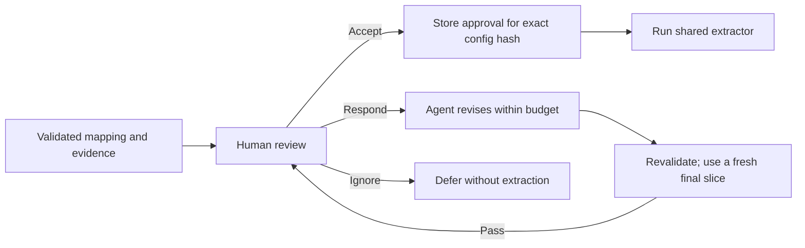

# Results and evaluation — start here

**Updated 19 September 2026.** Final approach: **Jev for catalogue triage + gpt-5.6-luna for schema inference**. Experiment: `jev-luna-v1`; batch: `fa5523f0-7d5a-41d2-af42-59e6362e3046`. This is a human-maintained summary of the saved [measurements](measurement-summary.json), not a live dashboard.

**Current outcome:** all six agent-generated mappings were approved and processed. The saved results contain **50 ranked datasets, 20,838 field observations, 52 proposed links and 52 business profiles**. Three of the six sources contribute evidence to these linked profiles. Estimated API cost is **about US$0.26 for the 275 calls we can price**; 17 additional calls have missing usage. **The core pipeline and output artifacts are complete. Evaluation is partially complete:** AI audits cover all 50 datasets (47 supported, 1 unsupported, 2 unresolved) and all 52 links (52 supported); the human hand-checks remain to be done. Cost reporting covers the 275 calls with recorded usage.

## 1. Completeness against the assignment

“Complete” below means the artifact or demonstrated behaviour exists, not that its accuracy is guaranteed. The assignment has **five parts; evaluation is required within Parts 1 and 3**, while Part 5 is the write-up.

| Requirement | Status | Saved result and evidence |
|---|---|---|
| Part 1: retrieve at least 200 catalogue records and rank 50 datasets | **Complete** | **945 unique records → 213 Jev-scored candidates → 50 download-verified ranked datasets**, with IDs, publishers, formats, confidence and reasons. [Shortlist](shortlist.jsonl), [discovery audit](discovery-audit.json) |
| Part 1: hand-check 20 random shortlisted datasets and report false positives | **Partially complete — AI audit complete; human check pending** | All 50 datasets were AI-audited: **47 supported, 1 unsupported, 2 unresolved**. The seeded 20-item human worksheet is ready; **0/20 human evidence reviews completed**, so a human false-positive rate is not yet available. [Worksheet](triage-review.html), [AI audit](ai-audit/FULL_SHORTLIST_REPORT.md) |
| Part 2: six diverse sources, agent-generated configs and one engine | **Complete** | Six downloadable sources from the shortlist, across four publishers; includes TSV and a multi-sheet Excel workbook. Six fresh Luna configs were user-approved. [Final configs](mappings/), [review decisions](README.md#8-mapping-approvals) |
| Part 2: multi-step inference, unseen-record validation, revision and approval | **Implemented and demonstrated** | Stateful LangGraph workflow, validation, semantic critique, bounded revisions and exact-config-hash approval. Failed and superseded attempts remain visible. [Run evidence](onboarding/), [acceptance checks](../docs/ENGINEERING.md#verification-evidence) |
| Part 2: sample extraction and onboarding measurements | **Outputs complete; usage partial** | **6,000 selected rows** (1,000/source) produce **20,838 observations**; field mappings, transformations, confidence and unmapped fields are retained. Step/time/token receipts exist, with missing usage disclosed below. [Observations](observations.jsonl), [selection](selection.json) |
| Part 3: proposed links, entity model and unlinked queue | **Complete** | **52 links** with identifiers, confidence and evidence; **5,543 unlinked records** with reasons. Stable internal entity IDs and versioned memberships; ambiguous relationships abstain. [Links](links.jsonl), [unlinked queue](unlinked.jsonl) |
| Part 3: hand-check 50 links and report measured precision | **Partially complete — AI audit complete; human check pending** | AI reviewed **all 52 links: 52 supported**. The seeded human worksheet selects 50 links; **0/50 human evidence reviews completed**, so human precision is not yet available. [Worksheet](link-review.html), [AI link audit](ai-audit/LINKS_REPORT.md) |
| Part 4: at least 50 profiles with per-field confidence, provenance and conflicts | **Complete for the selected cohort** | **52 profiles**, preserving alternatives, selection reasons and uncertainty; unavailable fields omitted. **539 OKF documents, 962 evidence edges, zero broken internal links**. [Profiles](profiles.jsonl), [OKF viewer](okf/viewer.html) |
| Part 4: explain the effect of removing a source | **Complete** | Recomputed values/provenance and separately checked loss of cross-source identity support. Human-readable table below; [full results](source-removal.json) |
| Part 5: maximum two-page explanation | **Written; page-layout check pending** | [WRITEUP.md](../WRITEUP.md) covers design, costs, difficult sources, limitations and future work. [engineering notes](../docs/ENGINEERING.md) supplies longer supporting answers. |
| Submission: runnable code, README and saved outputs | **Available; restore verified** | [README](../README.md), code, outputs and a [frozen demo](../docs/DEMO.md#optional-restore-a-frozen-demo). Actual archive restore verified; fresh-checkout startup under ten minutes has not been timed. |
| Budget and six-hour time box | **Cost estimate recorded; timing coverage partial** | Priced API calls total **$0.261160344**, below $10, but 17 calls are unpriced. Complete active development time was not recorded, so the six-hour time box is unverified. |



This diagram shows processing stages, not additive counts. [Illustrated screen-sharing demo](../docs/DEMO.md).

An **observation** is one field claim, not one company. A **link** joins source records; a **profile** combines claims for an entity. Filtering and quarantine mean row, observation and unlinked counts are not interchangeable. OKF edges are document/evidence citations, not additional identity links.

Part 1 was refreshed independently using the same saved catalogue and Jev scores: **35 shortlist entries retained, 15 replaced, zero additional model calls**. All six portfolio sources remain in the new shortlist. Download checks use bounded samples and do not guarantee full-file extraction. [Download-check report and commands](part1-downloadable/REPORT.md). Parts 2–4 and their saved outputs remain unchanged.

## 2. What was processed, and which sources contributed

The pipeline inspected bounded pools of **up to 25,000 records per source**, selected an identifier-overlap cohort targeting 50 linked entities, then filled each source to 1,000 rows using deterministic ordering. The added rows produced two more matched entities, giving **52 profiles**. This is a sampled demonstration, not a full-dataset linking run or a representative coverage estimate.

| Source / approved config | Observations | Profiles receiving evidence | What explains the result |
|---|---:|---:|---|
| [ASIC Companies — v3](mappings/asic-companies.json) | 3,813 | **52** | Current company names and validated identifiers anchor the linked cohort. |
| [ASIC Business Names — v2](mappings/asic-business-names.json) | 892 | **0** | Trading-name claims were extracted; uncertain holder/ABN ownership was left unmapped. |
| [ASIC AFS Licensees — v2](mappings/asic-afs-licensee.json) | 3,968 | **0** | Approved mapping extracts address fields; the mixed ABN/ACN column remains unmapped. Extending identifier coverage is a next improvement; AFS contributed to 18 baseline profiles and zero current profiles. |
| [ACNC Registered Charities — v1](mappings/acnc-register.json) | 7,192 | **17** | Explicit ABNs connect charity details, addresses and website evidence to company records. |
| [ATO Corporate Tax Transparency — v1](mappings/corporate-transparency.json) | 993 | **35** | Explicit ABN claims with the approved legal-entity role provide cross-source identity evidence. |
| [Employment Provider Locations — v2](mappings/employment-provider-locations-and-contacts.json) | 3,980 | **0** | Service-location address claims have no usable entity identifier; name-only linking is disabled. |
| **Total** | **20,838** | **52 unique profiles** | Profile contribution counts overlap; they must not be summed as unique businesses. |

All six sources were used for extraction. **Zero profile citations means no contribution to these linked profiles**, not that the source was never processed. The assignment does not require every business to appear in all six datasets. We preserve unmapped fields and unlinked records rather than inventing relationships to increase coverage.

There are **52 saved links in total**: 35 Companies–ATO and 17 Companies–ACNC, all based on explicit valid ABNs. There is no larger hidden link set behind the worksheet. [All links](links.jsonl), [source contribution counts](source-contributions.json).

### What changes if a source is removed?

| Removed source | Profiles with changed values | Profiles with changed provenance | Profiles losing cross-source linking support |
|---|---:|---:|---:|
| ASIC Companies | 52 | 52 | 52 |
| ACNC Charities | 17 | 17 | 17 |
| ATO Tax Transparency | 0 | 35 | 35 |
| ASIC Business Names | 0 | 0 | 0 |
| ASIC AFS Licensees | 0 | 0 | 0 |
| Employment Locations | 0 | 0 | 0 |

**ATO illustrates why value changes alone are insufficient:** deleting it leaves the selected field values unchanged, but removes corroborating provenance and cross-source support for 35 entities. Value comparisons keep original memberships fixed; identity support is separately re-resolved. These are deletion effects within this cohort, not a simulation of every possible incorrect claim. [Method and results](source-removal.json).

## 3. Evaluation progress and results

| Evaluation scope | AI evidence audit | Required human evaluation |
|---|---|---|
| All 50 ranked datasets | **47 supported, 1 unsupported, 2 unresolved** | Separate from the required random 20-item hand-check |
| Random 20-dataset worksheet | Included in the all-50 AI audit | **0/20 reviewed; human false-positive rate unknown** |
| All 52 proposed links | **52 supported, 0 unsupported, 0 unresolved** | Worksheet selects 50: **0/50 reviewed; human precision unknown** |

The refreshed Part 1 checked 93 candidates and retained 50 with readable downloaded samples. **Both unresolved cases concern appliance-brand ownership, not download failures.** The unsupported case contains asbestos asset records. The AI negative fraction is 1/48 (2.08%) among resolved judgments, with two unresolved; this is not human-measured accuracy. [Full findings](ai-audit/FULL_SHORTLIST_REPORT.md), [per-dataset evidence](ai-audit/full-shortlist-report.html).

For links, the AI audit checked raw records, explicit ABNs, names and subject roles. **52/52 supported is an AI evidence-support result**, not human-measured precision, independent registry truth or population recall. The linking threshold is a **0.99 rule score**, not a calibrated 99% probability. The cohort was deliberately selected for overlap. [Link findings](ai-audit/LINKS_REPORT.md), [per-link evidence](ai-audit/links-report.html).

Your six mapping approvals are complete. They approve how a source is interpreted; they do not verify each proposed link. Earlier all-Yes evaluation files were disclosed as not evidence-reviewed and remain unreviewed. Assistant audits are stored separately and never counted as human labels. [Evaluation instructions and status](README.md#9-complete-the-human-evaluation).

## 4. Tokens, estimated cost and time

**Readable cost summary:** Jev triage cost **about $0.008 (0.8 US cents)**; recorded Luna onboarding attempts cost **about $0.253 (25.3 US cents)**. Including the connectivity check gives **about $0.26**, with missing-usage calls excluded. This is the estimated cost of the current application experiment, including retained failures and retries—not a complete project bill.

| Measurement | Recorded result | Scope and interpretation |
|---|---:|---|
| Application model calls | **292** | 213 Jev triage calls + 79 Luna calls, including connectivity and failed/superseded attempts |
| Measured input tokens | **836,479** | Recorded usage covers 275 calls; usage for 17 calls is unavailable |
| Measured output tokens | **82,696** | Same coverage; Jev output tokens are recorded even though their price is zero |
| Measured combined tokens | **919,175** | Sum of recorded usage, not a complete billing quantity |
| Priced calls | **275/292** | Missing usage is unknown, not zero cost |
| Jev triage estimate | **$0.007996044** | All 213 calls priced |
| Luna six-source onboarding estimate | **$0.25308870** | All retained attempts: 61/78 calls priced |
| Luna connectivity check | **$0.00007560** | 1/1 call priced |
| **Estimated recorded subtotal** | **$0.261160344 (~$0.26)** | Published-rate calculation; full total remains unknown |
| Assignment $10 target | **Priced subtotal below target** | Recorded subtotal is below $10; full spend awaits usage for 17 calls |
| Per-record LLM calls / cost | **0 / $0** | Extraction, linking, profile assembly and OKF export are deterministic |
| Python exploration executions | **15** | Across retained onboarding runs, including earlier attempts |
| Complete active development time | **Unknown** | Not measured continuously from the start; no six-hour completion claim |

Prices are saved in [pricing_rates.json](../src/link_lens/pricing_rates.json): Jev input **$0.042/million**, output **$0/million**; Luna standard short-context input **$0.20/million**, cache read **$0.02/million**, cache write **$0.25/million**, output **$1.20/million**. OpenAI rates are our agreed approximation for Azure. The calculation distinguishes cached tokens. See [COSTS.md](COSTS.md) for each attempt, [cost-summary.json](cost-summary.json) for recalculated dollars, and [cost-usage.json](cost-usage.json) for receipts.

**One concrete onboarding example — final approved ATO run:** **9 instrumented graph steps, 2 model calls, 1 Python execution, 12,215 input tokens and 1,475 output tokens**, at an estimated **$0.00481080**. Recorded active node time was **16.52 seconds**, excluding human wait and queue time; model calls account for **15.03 seconds** of that. This is the successful replacement run only. Its earlier attempt adds **$0.00492275** in priced usage and has missing usage; both attempts are included in the overall ledger. Run: `28fb2b8c-85e9-4732-9e53-d38066fa9bf6`. [Run measurements and trace link](measurement-summary.json).

Use the recalculated published-rate totals in `cost-summary.json` for cost reporting; older per-run `calculated_cost_usd` fields in the measurement snapshot may differ from that calculation. Do not add model time to active node time: the latter already includes it. Neither is engineering time. Infrastructure and this coding conversation/later assistant audits are outside the application cost ledger; their cost is not measured here.

## 5. Achievements and next improvements

- **Final approach:** Jev judges catalogue metadata after deterministic format filtering; code now verifies a readable download before shortlisting; it does not run the Part 2 sandbox or inspect every downloaded dataset. Luna performs multi-step onboarding with tools, validation, critique and human approval. One shared engine performs extraction and resolution.
- **Next mapping improvement — AFS identifiers:** ATO now supports 35 profiles. AFS contributes zero, because an overly conservative critique led the approved mapping to omit its mixed ABN/ACN field. The shared engine already supports identifier classification. Improving the semantic critique could recover this coverage without adding a source-specific parser.
- **Auditable revision history:** retained attempts document malformed responses, conservative critiques, budget exhaustion and subsequent recovery. The final approvals can be traced through those iterations. [Review history](README.md#8-mapping-approvals), [implementation notes](../docs/ENGINEERING.md#implementation-notes).
- **Prior results are preserved:** the Terra baseline produced 50 profiles and estimated **$2.0150253 for 50/52 calls**. The current run has a lower priced subtotal, but different retries, prompts, shortlist and cohort prevent a controlled accuracy or percentage-savings claim. [Comparison](COMPARISON.md), [baseline result summary](../experiments/terra-baseline/outputs/README.md).
- **Verification:** 48 deterministic tests passed; four integration tests were skipped in that run. Earlier Docker checks are documented separately. Current archive restore was tested in a fresh temporary database and recovered all 52 profiles and links. [Acceptance evidence](../docs/ENGINEERING.md#verification-evidence).
- **Assignment versus additions:** Docker services, PostgreSQL, Agent Inbox, OKF and frozen demonstrations support reuse and presentation. They are broader than the minimal six-hour assignment. Remaining submission checks are human evaluation, usage reconciliation, a timed clean-checkout run and final two-page write-up layout.

## 6. Where to look next

For a short presentation: use this overview, open **[one OKF dossier](okf/viewer.html)**, show **[a link's evidence](ai-audit/links-report.html)**, then discuss one next improvement from the comparison.

| Need | Location |
|---|---|
| Start services or reproduce results | [README](../README.md), [final approach commands](../docs/ENGINEERING.md#operations-and-recovery) |
| Understand implementation decisions | [engineering notes](../docs/ENGINEERING.md) |
| Read the short assignment explanation | [WRITEUP.md](../WRITEUP.md) |
| Inspect final mappings, revisions and approvals | [mappings/](mappings/), [onboarding/](onboarding/), [approval records](#8-mapping-approvals) |
| Inspect exact selected records | [selection.json](selection.json) |
| Inspect application results | [observations](observations.jsonl), [links](links.jsonl), [unlinked records](unlinked.jsonl), [profiles](profiles.jsonl) |
| Compare Terra with Jev + Luna | [COMPARISON.md](COMPARISON.md) |
| Browse saved results without model credentials | [Frozen-demo instructions](../docs/DEMO.md#optional-restore-a-frozen-demo); current archive is `demo/jev-luna-v1.zip` |
| Follow the illustrated workflow | [Demo guide](../docs/DEMO.md) |

## 7. The seventh-source demonstration

The assignment asks whether the agent **could onboard a seventh unfamiliar dataset**; it does not require a seventh source in the six-source profile batch. The old **ASIC Credit Licensees** onboarding belongs to the preserved Terra experiment, not this Luna batch.

For the next live demonstration, use **ACNC 2024 Annual Information Statement**. Preflight found **three ABN overlaps with the current 52 profiles** in the saved sample. This establishes feasibility, not a generated config or guaranteed contribution. It has **not yet been onboarded in this experiment**. Follow the [copy-and-paste seventh-source guide](../docs/DEMO.md#live-seventh-source-demo), review the new config, then check its actual contribution in a separate seven-source export.

## 8. Mapping approvals




The current six mappings have already followed the Accept path. Respond is a revision request, so a subsequent “Requires Action” entry is expected. Budget exhaustion or failed final validation stops the path before approval. Mapping approval and the separate evaluation of individual links answer different questions.

See [the illustrated review walkthrough](../docs/DEMO.md#3-explain-one-mapping--about-two-minutes) for the screenshot and controls. Its ACNC v2 screenshot is an earlier proposal; use the final packets below for current evidence.

| Approved source | Final packet |
|---|---|
| ASIC Companies | [v3 review](onboarding/asic-companies/e619a3e2-1ac5-4c56-8f9a-64ef0bd80918/review.md) |
| ASIC Business Names | [v2 review](onboarding/asic-business-names/8acd7625-6835-4790-af94-aaa88cec9c03/review.md) |
| ASIC AFS Licensees | [v2 review](onboarding/asic-afs-licensee/42e0a217-dc32-4078-8309-65098f5a831b/review.md) |
| ACNC Charities | [v1 review](onboarding/acnc-register/2ea0c664-13ab-4fe5-aba3-e19dbedecfde/review.md) |
| ATO Tax Transparency | [v1 review](onboarding/corporate-transparency/28fb2b8c-85e9-4732-9e53-d38066fa9bf6/review.md) |
| Employment Locations | [v2 review](onboarding/employment-provider-locations-and-contacts/7c816605-4497-4040-b96d-a8f93580517b/review.md) |

## 9. Complete the human evaluation

AI audits are complete; the required human evidence checks remain pending. Open [the 20-dataset worksheet](triage-review.html) and [the 50-link worksheet](link-review.html). Review the supplied evidence and record yes/no/unsure, reviewer and a reason. Blank or unreviewed responses never count as correct; source mapping approval is a separate decision.

Import only genuinely evidence-reviewed labels from the completed worksheet files:

```sh
uv run link-lens import-labels PATH_TO_COMPLETED_TRIAGE_JSON
uv run link-lens import-labels PATH_TO_COMPLETED_LINKS_JSON
```

The dataset worksheet follows the current download-verified shortlist. The link worksheet follows the unchanged 52-link batch. Historical all-Yes responses that were not evidence-reviewed are excluded from human metrics. AI labels are stored separately as `ai_label` records.
